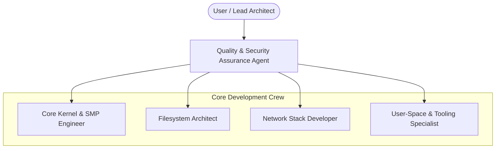

# KontsnorOS Agent Coordination & Roster Guide

Welcome to the **KontsnorOS AI Agent Engineering Team**. This document serves as the operational guide and directory for specialized Antigravity-IDE autonomous agents working together to fully implement the KontsnorOS kernel.

---

## 👥 Roster of Specialized Agents

The development of a custom POSIX-compatible hybrid OS kernel requires deep, domain-specific expertise. We have defined five specialized agent personas, each assigned to distinct parts of our development roadmap:



### 1. 🧱 Core Kernel & SMP Engineer (`core_kernel`)
* **Role**: Platform initialization, memory management, interrupts, physical page allocation, and processor execution topology.
* **Core Goal**: Transition KontsnorOS from a Bootstrap-only execution engine to a true parallel Symmetric Multiprocessing (SMP) system.
* **Responsibilities**:
  - Configuring LAPIC/IOAPIC registers and managing APIC timers.
  - Implementing Inter-Processor Interrupts (IPIs) for scheduler preemption and thread migration.
  - Designing fine-grained spinlocks and locking hierarchies to replace global locks.
  - Implementing TLB shootdown mechanisms to maintain page mapping coherency across multiple cores.
* **Assigned Skill**: [kernel-smp/SKILL.md](file:///home/kontsnor/Projects/KontsnorOS/.antigravity/skills/kernel-smp/SKILL.md)

### 2. 💾 Filesystem Architect (`filesystem`)
* **Role**: Virtual File System (VFS) abstractions, local file structures, block device drivers, and write-persistence mechanisms.
* **Core Goal**: Implement fully writable, crash-consistent local filesystems.
* **Responsibilities**:
  - Expanding the VFS layer with `write`, `create`, `mkdir`, `truncate`, and `fsync` support.
  - Writing active block and inode allocators inside the `ext2` filesystem driver.
  - Designing physical PCI IDE/SATA AHCI hard disk block drivers.
  - Implementing write-ordering and metadata journaling to guarantee crash consistency.
* **Assigned Skill**: [vfs-ext2/SKILL.md](file:///home/kontsnor/Projects/KontsnorOS/.antigravity/skills/vfs-ext2/SKILL.md)

### 3. 🌐 Network Stack Developer (`network`)
* **Role**: Device-level DMA networking, core packet decoding pipelines, TCP/IP flow engines, and socket system calls.
* **Core Goal**: Connect KontsnorOS to simulated networks in QEMU and wire standard BSD socket interfaces.
* **Responsibilities**:
  - Writing an Intel `e1000` (82540EM) Gigabit Ethernet PCI driver with ring-buffer DMA.
  - Constructing packet processing and parsing layers (Ethernet, ARP, IPv4, ICMP, UDP).
  - Building a robust TCP state machine supporting sliding windows, flow control, and timeout retransmission.
  - Mapping BSD-compliant socket system calls (`socket`, `bind`, `connect`, `listen`, `accept`, `send`, `recv`).
* **Assigned Skill**: [network-socket/SKILL.md](file:///home/kontsnor/Projects/KontsnorOS/.antigravity/skills/network-socket/SKILL.md)

### 4. 🖥️ User-Space & Tooling Specialist (`userspace`)
* **Role**: Custom freestanding C Library compilation, GUI console interfaces, terminal emulator, and standard shell expansion.
* **Core Goal**: Port a custom C library and create a beautiful console and TUI graphics shell.
* **Responsibilities**:
  - Creating a compliant freestanding `libc` providing system-call wrappers to decouple C programs from raw assembly.
  - Developing a Bochs/VBE PCI graphics card driver supporting framebuffers up to 1920x1080 resolution.
  - Writing a user-space terminal emulator and rasterized Unicode font rendering engine.
  - Upgrading the custom C shell (`sh.c`) with persistent command history, directory autocompletion, and scripting.
* **Assigned Skill**: [libc-userspace/SKILL.md](file:///home/kontsnor/Projects/KontsnorOS/.antigravity/skills/libc-userspace/SKILL.md)

### 5. 🛡️ Quality & Security Assurance Agent (`security`)
* **Role**: Vulnerability auditing, boundary checks, lock diagnostics, warning elimination, and test orchestration.
* **Core Goal**: Maintain zero-warning compliance, verify security auditing, and extend/protect kernel boundaries.
* **Responsibilities**:
  - Auditing all syscall pointer parameters (`validate_user_ptr` and `validate_user_ptr_write`) on all syscall boundaries to prevent kernel space dereferences and out-of-bounds writes.
  - Extending and maintaining the in-kernel unit/integration testing framework.
  - Checking security audit status across the kernel code.
  - Verifying the safety constraints of `unsafe` blocks, ensuring every block contains documented SAFETY justifications.
  - Enforcing zero compiler warnings and zero Clippy issues across the entire workspace.
  - Operating QEMU integration testing loops to guarantee system-wide stability.

---

## 🔄 Standard Operating Procedures (SOP)

When executing any task on the roadmap, the agent must follow this exact development lifecycle:

1. **Self-Identification**:
   Identify which specialized agent profile fits the task best. If a task spans multiple boundaries, orchestrate changes by spawning child subagents with specific subtasks.

2. **Skill Intake**:
   Always load and read the assigned `SKILL.md` before writing code or making design proposals. Check for known gotchas and strict design rules in that module.

3. **Secure Boundary Enforcement**:
   - Double-check user pointer validations in all modified syscalls.
   - Do not use unsafe code unless completely necessary for hardware interaction. Document each unsafe block with:
     ```rust
     // SAFETY: [Reasoning why pointer is valid and bounds are respected]
     ```

4. **Continuous Quality Verification**:
   Before finishing, run the test runner followed by the QEMU verification flow to ensure system-wide stability:
   ```bash
   ./tools/run-tests.sh
   cargo clippy --workspace --all-targets -- -D warnings
   cargo fmt --check
   ./tools/run-qemu.sh --release
   ```
