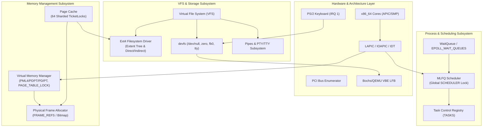

# KontsnorOS Kernel Architecture, Stability & Performance Audit

**Date:** September 16, 2026  
**Target:** KontsnorOS x86_64 Kernel Codebase  
**Auditor:** Specialized Kernel Architecture & Security Assurance Team  
**Scope:** Virtual Memory Management (VMM) & Paging; Virtual File System (VFS), Buffer Cache & Storage; Task Scheduling, Timing & IPC; Hardware Drivers & Device Subsystems.

---

## 1. Architecture & Subsystem Map

KontsnorOS is implemented in freestanding Rust (`#![no_std]`) as a hybrid microkernel supporting Symmetric Multiprocessing (SMP, up to 32 cores) and POSIX-compliant userspace container workloads.



### Core Subsystems Interaction Summary

1. **Virtual Memory Management (VMM):**
   * **Physical Allocator** ([physical.rs](file:///home/kontsnor/Projects/KontsnorOS/kernel/src/memory/physical.rs)): Tracks memory frames with a global bitmap and an atomic reference count array (`FRAME_REFS`) for Copy-on-Write (CoW).
   * **Virtual Mapper** ([virtual.rs](file:///home/kontsnor/Projects/KontsnorOS/kernel/src/memory/virtual.rs)): Manages 4-level x86_64 page tables under a single global spinlock (`PAGE_TABLE_LOCK`). User address spaces share the higher-half kernel mapping (entries 256..511).
   * **Page Fault Engine** ([interrupts.rs](file:///home/kontsnor/Projects/KontsnorOS/kernel/src/arch/x86_64/interrupts.rs)): Intercepts vector 14. Implements CoW resolution, demand paging for file and anonymous `mmap` regions, and two-phase heuristic stack expansion.

2. **VFS, Buffer Cache & Filesystems:**
   * **VFS & DevFS** ([vfs.rs](file:///home/kontsnor/Projects/KontsnorOS/kernel/src/fs/vfs.rs), [devfs.rs](file:///home/kontsnor/Projects/KontsnorOS/kernel/src/fs/devfs.rs)): Abstract `InodeOps` table supporting mount points, path resolution, and pseudo-devices (`/dev/null`, `/dev/zero`, `/dev/fb0`).
   * **Page Cache** ([page_cache.rs](file:///home/kontsnor/Projects/KontsnorOS/kernel/src/memory/page_cache.rs)): Sharded into 64 sub-maps indexed by `(dev, ino, aligned_offset)` to reduce hash table contention.
   * **Ext4 Driver** ([ext/file.rs](file:///home/kontsnor/Projects/KontsnorOS/kernel/src/fs/ext/file.rs), [ext/alloc.rs](file:///home/kontsnor/Projects/KontsnorOS/kernel/src/fs/ext/alloc.rs)): Supports legacy direct/indirect block allocation and 1-level Ext4 extent trees (`eh_depth = 0` or `1`).

3. **Task Scheduling, Timing & IPC:**
   * **MLFQ Scheduler** ([scheduler.rs](file:///home/kontsnor/Projects/KontsnorOS/kernel/src/process/scheduler.rs)): Multi-Level Feedback Queue with 5 priority levels, starvation prevention boosting, and per-core idle tasks. Synchronized globally via `SCHEDULER: Mutex<Option<Scheduler>>`.
   * **WaitQueue Engine** ([wait_queue.rs](file:///home/kontsnor/Projects/KontsnorOS/kernel/src/sync/wait_queue.rs)): TicketLock-protected task queues coupled to scheduler wakeups.
   * **Pipes & PTYs** ([pipe.rs](file:///home/kontsnor/Projects/KontsnorOS/kernel/src/fs/pipe.rs), [pty.rs](file:///home/kontsnor/Projects/KontsnorOS/kernel/src/fs/pty.rs)): Memory ring-buffer channels with termios line discipline emulation.

4. **Hardware Drivers & Device Layer:**
   * **PCI Bus** ([pci.rs](file:///home/kontsnor/Projects/KontsnorOS/kernel/src/drivers/bus/pci.rs)): Type 1 configuration space scanner using ports `0xCF8`/`0xCFC`.
   * **GPU/Console** ([bochs.rs](file:///home/kontsnor/Projects/KontsnorOS/kernel/src/drivers/gpu/bochs.rs)): Bochs VBE Dispi interface driver using ports `0x1CE`/`0x1CF` with higher-half linear framebuffer mapping.
   * **Keyboard** ([keyboard.rs](file:///home/kontsnor/Projects/KontsnorOS/kernel/src/drivers/keyboard.rs)): Legacy PS/2 port `0x60` translator for Set 1 make/break codes.

---

## 2. Identified Vulnerabilities & Stability Risks

### 2.1 [CRITICAL] Stack Growth Failure on Kernel Mode User-Pointer Access (Signal Delivery Crash)
* **Location:** [kernel/src/arch/x86_64/interrupts.rs:657-668](file:///home/kontsnor/Projects/KontsnorOS/kernel/src/arch/x86_64/interrupts.rs#L657-L668) & [kernel/src/syscall/signal.rs:638-645](file:///home/kontsnor/Projects/KontsnorOS/kernel/src/syscall/signal.rs#L638-L645)
* **Mechanism:**
  In [interrupts.rs:657](file:///home/kontsnor/Projects/KontsnorOS/kernel/src/arch/x86_64/interrupts.rs#L657), stack auto-growth explicitly mandates that the page fault originated from Ring 3 (`is_user` is true):
  ```rust
  if is_user && !error_code.contains(PageFaultErrorCode::PROTECTION_VIOLATION) { ... }
  ```
  However, during signal delivery in [signal.rs:638](file:///home/kontsnor/Projects/KontsnorOS/kernel/src/syscall/signal.rs#L638), the kernel constructs and writes the `RtSigFrame` directly to the user stack:
  ```rust
  unsafe { core::ptr::write(new_user_sp as *mut RtSigFrame, frame); }
  ```
  If `new_user_sp` points into an unallocated page just below the current stack boundary that requires stack expansion, the write triggers a page fault in **Kernel Mode** (`is_user == false`).
* **Failure Mode:**
  Stack auto-growth is bypassed because `is_user` is false. The fault falls through to lines 875–888:
  ```rust
  if !is_user && is_user_space_addr {
      kprintln!("[page_fault] KERNEL mode fault in user-space addr... Killing process.");
      let _ = crate::syscall::process::sys_exit_group(139);
      loop { x86_64::instructions::hlt(); }
  }
  ```
  This immediately terminates the process with a SIGSEGV exit status (`139`) simply because a signal was delivered to a deep call stack.

---

### 2.2 [CRITICAL] Kernel #GP Panic via Unsanitized `mctx.rip` in `sys_rt_sigreturn`
* **Location:** [kernel/src/syscall/signal.rs:672-692](file:///home/kontsnor/Projects/KontsnorOS/kernel/src/syscall/signal.rs#L672-L692)
* **Mechanism:**
  `sys_rt_sigreturn` reads the user-controlled `ucontext` structure from userspace memory and directly restores processor execution registers:
  ```rust
  let frame = &*frame_ptr;
  let mctx = &frame.uc.uc_mcontext;
  (*regs).rflags = (mctx.eflags & !0x3000) | 0x202;
  (*regs).rip = mctx.rip;
  (*regs).rsp = mctx.rsp;
  ```
* **Failure Mode:**
  There is **zero canonical address validation** or range validation on `mctx.rip`.
  1. If userspace specifies a non-canonical virtual address (e.g., `0x8000_0000_0000_0000` or `0x0000_8000_0000_0000`), the CPU executes `sysretq` or `iretq` with a non-canonical target. On x86_64, `sysretq` / `iretq` with non-canonical RIP throws a **General Protection Fault (`#GP`) in Ring 0 (Kernel Mode)**.
  2. If userspace specifies a kernel-space virtual address (`>= 0xFFFF_8000_0000_0000`), returning to user mode causes kernel code execution or crashes.

---

### 2.3 [CRITICAL] Instruction Fetch Fault (`RIP = 0x0`) Immediately Halts CPU Core
* **Location:** [kernel/src/arch/x86_64/interrupts.rs:855-864](file:///home/kontsnor/Projects/KontsnorOS/kernel/src/arch/x86_64/interrupts.rs#L855-L864) & [lifecycle.rs:888-920](file:///home/kontsnor/Projects/KontsnorOS/kernel/src/syscall/process/lifecycle.rs#L888-L920)
* **Mechanism:**
  When userspace attempts to jump to a null pointer (`RIP = 0x0`), a page fault is raised with `fault_addr = 0x0`. In [interrupts.rs:855](file:///home/kontsnor/Projects/KontsnorOS/kernel/src/arch/x86_64/interrupts.rs#L855):
  ```rust
  let _ = crate::syscall::process::sys_exit_group(139);
  loop {
      x86_64::instructions::hlt();
  }
  ```
  In [lifecycle.rs:888](file:///home/kontsnor/Projects/KontsnorOS/kernel/src/syscall/process/lifecycle.rs#L888), `sys_exit_group` calls `x86_64::instructions::interrupts::disable()`.
* **Failure Mode:**
  1. **POSIX Violation:** The kernel fails to dispatch `SIGSEGV` with `si_code = SEGV_MAPERR`. Any user crash handler, JIT compiler (V8, JVM), or debugger attached to the container is unable to trap the null pointer dereference.
  2. **CPU Lockup:** If `scheduler::schedule()` returns without context-switching (e.g., if no other runnable tasks exist on this CPU core), the handler enters `loop { hlt(); }` with **interrupts disabled (`IF = 0`)**. The core is completely frozen and can never wake up, requiring a physical power cycle or QEMU hard reset.

---

### 2.4 [CRITICAL] Ext4 Extent Tree Corruption and False `ENOSPC` on Sparse / Out-of-Order Writes
* **Location:** [kernel/src/fs/ext/file.rs:291-325, 402-482, 556](file:///home/kontsnor/Projects/KontsnorOS/kernel/src/fs/ext/file.rs#L291-L325)
* **Mechanism:**
  1. **Unsorted Extent Insertions:** In [file.rs:291](file:///home/kontsnor/Projects/KontsnorOS/kernel/src/fs/ext/file.rs#L291), new extents are appended at `root_hdr.eh_entries` without maintaining order:
     ```rust
     let offset = 12 + (root_hdr.eh_entries as usize) * core::mem::size_of::<Ext4Extent>();
     unsafe { core::ptr::write_unaligned(root_buf[offset..].as_mut_ptr() as *mut Ext4Extent, new_ext); }
     root_hdr.eh_entries += 1;
     ```
     Ext4 specification requires extent entries to be **strictly sorted by `ee_block`**. Out-of-order writes (e.g., `pwrite64` at 10 MB followed by `pwrite64` at 0 MB) violate filesystem invariants.
  2. **Blind Depth-1 Index Selection:** When `eh_depth == 1` ([file.rs:407-413](file:///home/kontsnor/Projects/KontsnorOS/kernel/src/fs/ext/file.rs#L407-L413)), block allocation unconditionally selects the *last* index entry:
     ```rust
     let last_idx_offset = 12 + (num_indices - 1) * core::mem::size_of::<Ext4ExtentIdx>();
     let last_idx = unsafe { core::ptr::read_unaligned(...) };
     let leaf_block = last_idx.leaf_block();
     ```
     Any write to an earlier logical block is inserted into the final leaf block, destroying the non-overlapping range hierarchy.
  3. **Capacity Hard Ceiling (False ENOSPC):** The extent tree only supports depths 0 and 1. If 4 leaf blocks fill up (each holds 340 extents, total 1360 extents), line 556 throws:
     ```rust
     Err("Ext4 extent tree maximum capacity exceeded")
     ```
* **Failure Mode:**
  Writing a fragmented or sparse file larger than ~5.4 MB fails with `ENOSPC` / `EIO` even when hundreds of gigabytes remain free on the disk. Standard Linux tools like `fsck.ext4` will mark the entire volume corrupted.

---

### 2.5 [CRITICAL] Deadlock and Data Loss in `sync()` and Uncached Extent Metadata
* **Location:** [kernel/src/fs/ext/mod.rs:1353-1366](file:///home/kontsnor/Projects/KontsnorOS/kernel/src/fs/ext/mod.rs#L1353-L1366) & [kernel/src/fs/ext/alloc.rs:139-142](file:///home/kontsnor/Projects/KontsnorOS/kernel/src/fs/ext/alloc.rs#L139-L142)
* **Mechanism:**
  `ExtFileSystem::sync(&self)` flushes dirty page cache frames to the inode driver, but:
  1. It **never issues a flush cache command** to the block device (`self.device.flush()` or ATA `FLUSH CACHE EXT`). Data in drive volatile buffers is lost on power loss.
  2. `ExtFileSystem::sync` only queries `dirty_inodes_for_dev(EXT_DEV_ID)`. If multiple ext4 partitions or loop devices are mounted, all non-default filesystems are silently ignored and never flushed.
  3. In [alloc.rs:139-142](file:///home/kontsnor/Projects/KontsnorOS/kernel/src/fs/ext/alloc.rs#L139-L142), every block allocation writes the superblock and all group descriptors synchronously to disk:
     ```rust
     self.write_superblock(&sb)?;
     drop(gds);
     self.write_group_descriptors()?;
     ```
     If an I/O stalls or an interrupt fires while holding `self.superblock.lock()`, other threads calling `statfs` or block allocation deadlock immediately.

---

### 2.6 [CRITICAL] Race Condition in `WaitQueue::wait()`
* **Location:** [kernel/src/sync/wait_queue.rs:44-61](file:///home/kontsnor/Projects/KontsnorOS/kernel/src/sync/wait_queue.rs#L44-L61)
* **Mechanism:**
  ```rust
  x86_64::instructions::interrupts::without_interrupts(|| {
      let sched_lock = scheduler::SCHEDULER.lock();
      self.pids.lock().push_back(current_pid);
      if let Some(task_arc) = scheduler::get_task_arc(current_pid) {
          task_arc.lock().state = TaskState::Blocked;
      }
      drop(sched_lock);
  });
  // WINDOW: Interrupts re-enabled, SCHEDULER unlocked!
  scheduler::schedule();
  ```
* **Failure Mode:**
  After `without_interrupts` returns, interrupts are re-enabled and `SCHEDULER` is unlocked. If a concurrent event (e.g., packet arrival or pipe write) calls `wake_all()`, the task is transitioned from `TaskState::Blocked` back to `TaskState::Ready` and pushed into `queues`.
  When execution proceeds to `scheduler::schedule()`, `schedule()` observes `current_task.state == TaskState::Ready` on this core and might deschedule it, leaving queue states mismatched or inducing missed-wakeup deadlocks.

---

### 2.7 [HIGH] Boot Panic on Pre-Haswell CPUs via Unchecked CR4.FSGSBASE Enablement
* **Location:** [kernel/src/arch/x86_64/boot.rs:65-72](file:///home/kontsnor/Projects/KontsnorOS/kernel/src/arch/x86_64/boot.rs#L65-L72) & [smp.rs:487-495](file:///home/kontsnor/Projects/KontsnorOS/kernel/src/arch/x86_64/smp.rs#L487-L495)
* **Mechanism:**
  During CPU feature initialization, CR4 bit 16 is set unconditionally:
  ```rust
  "mov rax, cr4",
  "or rax, 0x10000", // Bit 16 (FSGSBASE)
  "mov cr4, rax",
  ```
* **Failure Mode:**
  No CPUID check (`CPUID.(EAX=07H, ECX=0H):EBX[bit 0]`) is performed. On Intel processors older than Haswell (2013), AMD processors older than Piledriver, or virtualized hypervisors without FSGSBASE passthrough, writing to CR4 bit 16 raises an immediate `#GP` exception in `boot.rs`, completely preventing kernel initialization.

---

### 2.8 [HIGH] Broken `isatty()` and Termios Probing via Non-Standard `ioctl` Return Code
* **Location:** [kernel/src/fs/inode.rs:329-331](file:///home/kontsnor/Projects/KontsnorOS/kernel/src/fs/inode.rs#L329-L331) & [devfs.rs:555](file:///home/kontsnor/Projects/KontsnorOS/kernel/src/fs/devfs.rs#L555)
* **Mechanism:**
  The default `InodeOps::ioctl` implementation and `/dev/fb0` unhandled branches return `-22` (`-EINVAL`):
  ```rust
  fn ioctl(&self, _request: u64, _arg: u64) -> Result<u64, i32> {
      Err(-22) // EINVAL
  }
  ```
* **Failure Mode:**
  POSIX.1-2017 and Linux ABI require unsupported `ioctl` requests on file descriptors that are not terminals (or unsupported device ioctls) to return **`-ENOTTY` (`-25`, "Inappropriate ioctl for device")**.
  Standard C libraries (`glibc`, `musl`, `bionic`) implement `isatty(fd)` by issuing `TCGETS` / `TIOCGWINSZ` and checking if `errno == ENOTTY`. Because KontsnorOS returns `-EINVAL`, `isatty()` fails with `EINVAL`, breaking terminal detection in `bash`, `coreutils`, `ls --color`, and python runtimes.

---

### 2.9 [HIGH] Infinite Busy-Spin Loops in PTY Master and Slave Reads
* **Location:** [kernel/src/fs/pty.rs:83-96, 325-360](file:///home/kontsnor/Projects/KontsnorOS/kernel/src/fs/pty.rs#L83-L96)
* **Mechanism:**
  When `PtySlave::read` or `PtyMaster::read` is invoked and the buffer queue is empty, the driver executes:
  ```rust
  // Yield cooperatively to wait for master writes
  crate::process::scheduler::yield_now();
  ```
* **Failure Mode:**
  1. **Zero `O_NONBLOCK` Support:** The driver never checks the open flags or `FIONBIO`. Non-blocking reads fail to return `-EAGAIN`.
  2. **100% CPU Saturation:** The task remains in `TaskState::Running` / `TaskState::Ready`. It spins continuously yielding to the scheduler. If no other active processes exist, it is instantly rescheduled, saturating the CPU core at 100% and preventing the processor from executing power-saving `HLT` instructions.

---

## 3. Performance Bottlenecks

### 3.1 Global Scheduler Spinlock Serializes Context Switches Across All 32 SMP Cores
* **Location:** [kernel/src/process/scheduler.rs:661-815, 899](file:///home/kontsnor/Projects/KontsnorOS/kernel/src/process/scheduler.rs#L661-L815)
* **Description:**
  A single global lock, `SCHEDULER`, guards all priority queues, current CPU tracking, and task state transitions.
  Crucially, `SCHEDULER.lock()` is acquired at the start of `schedule()` ([scheduler.rs:661](file:///home/kontsnor/Projects/KontsnorOS/kernel/src/process/scheduler.rs#L661)) and **held across the raw stack switch and register restoration** ([scheduler.rs:810-815](file:///home/kontsnor/Projects/KontsnorOS/kernel/src/process/scheduler.rs#L810-L815)), only released inside the new thread or `scheduler_unlock_after_switch` via `SCHEDULER.force_unlock()`.
* **Impact:**
  Only **one CPU core at a time** can execute a context switch or make a scheduling decision. On 16- or 32-core systems, parallel thread synchronization results in severe lock convoying and quadratic spinlock latency.

---

### 3.2 Global Thundering Herd on Every Kernel Event via `wake_all_epolls()`
* **Location:** [kernel/src/fs/epoll.rs:77-105](file:///home/kontsnor/Projects/KontsnorOS/kernel/src/fs/epoll.rs#L77-L105) & [meta.rs:1000-1021](file:///home/kontsnor/Projects/KontsnorOS/kernel/src/syscall/fs/meta.rs#L1000-L1021)
* **Description:**
  Every time a TCP packet arrives, a pipe is written to, a signal is delivered, or a terminal key is pressed, the kernel executes `wake_all_epolls()`:
  ```rust
  let wqs = EPOLL_WAIT_QUEUES.lock();
  for wq in wqs.iter() {
      wq.wake_all_locked(sched);
  }
  ```
  Every single thread blocked in `poll()`, `select()`, `pselect6()`, or `epoll_wait()` across all containers is woken up simultaneously.
* **Impact:**
  If 50 server workers or worker threads are polling on different sockets/pipes, a single byte written on unrelated pipe `fd=3` wakes up all 50 threads. Each thread acquires heap allocations, traverses its file descriptors, finds nothing ready, and re-registers into `EPOLL_WAIT_QUEUES`.

---

### 3.3 Dynamic Heap Allocation and O(N) Traversal on Every `poll()` / `select()` Syscall
* **Location:** [kernel/src/syscall/fs/meta.rs:1000-1021, 1038](file:///home/kontsnor/Projects/KontsnorOS/kernel/src/syscall/fs/meta.rs#L1000-L1021)
* **Description:**
  On every single invocation of `sys_poll`:
  1. An `Arc<WaitQueue>` is dynamically allocated on the kernel heap ([meta.rs:1006](file:///home/kontsnor/Projects/KontsnorOS/kernel/src/syscall/fs/meta.rs#L1006)).
  2. The global `EPOLL_WAIT_QUEUES` mutex is acquired with interrupts disabled to push the guard.
  3. On syscall exit, `PollWaitGuard::drop` acquires the global mutex and executes `wqs.retain(...)`, an $O(N)$ linear vector search and shift.
  4. Line 1038 performs a dynamic heap allocation `alloc::vec![PollFd; nfds]` even for single-fd polls.
* **Impact:**
  Massive heap fragmentation and cache line contention on high-frequency event loops (Node.js, Nginx, Redis).

---

### 3.4 Unconditional TLB Invalidation (`CR3` Reload) on Same-Process Context Switches
* **Location:** [kernel/src/process/context.rs:213-216](file:///home/kontsnor/Projects/KontsnorOS/kernel/src/process/context.rs#L213-L216)
* **Description:**
  In `switch_context`, the page table root is reloaded unconditionally:
  ```rust
  "test r11, r11",
  "jz 4f",
  "mov cr3, r11",
  "4:",
  ```
* **Impact:**
  When switching between two threads sharing the same `AddressSpace` (e.g., in multi-threaded runtimes or Go/Rust programs), `CR3` is written with the exact same physical address. In the absence of PCID, writing to `CR3` invalidates all non-global TLB entries, purging L1/L2 translation caches and degrading memory access speed.

---

### 3.5 Heavyweight FPU/SSE Save/Restore and MSR Access on Every Context Switch
* **Location:** [kernel/src/process/context.rs:186-192, 197, 225-228](file:///home/kontsnor/Projects/KontsnorOS/kernel/src/process/context.rs#L186-L192)
* **Description:**
  `switch_context` unconditionally executes `fxsave64 [rdi + 0x70]` (512 bytes) and `fxrstor64 [rsi + 0x70]`. It also executes `rdmsr` and `wrmsr` for `IA32_KERNEL_GS_BASE` (0xC0000102).
* **Impact:**
  Tasks that perform integer-only computations or short I/O operations are penalized with ~400–600 CPU cycles of unnecessary memory bus transactions and slow microcode MSR writes on every scheduling cycle.

---

### 3.6 Full Task Array Scan on Every 500ms Timer Tick and Inode Sync
* **Location:** [kernel/src/process/scheduler.rs:188-206](file:///home/kontsnor/Projects/KontsnorOS/kernel/src/process/scheduler.rs#L188-L206) & [page_cache.rs:394-400](file:///home/kontsnor/Projects/KontsnorOS/kernel/src/memory/page_cache.rs#L394-L400)
* **Description:**
  1. In `scheduler.rs:188`, every 50 ticks the scheduler iterates over all slots in `TASKS.read()` and attempts to acquire `task_arc.try_lock()` on every task.
  2. In `page_cache.rs:394`, flushing dirty pages for a single inode clones all task Arcs in `TASKS` and walks every mapped virtual page table looking for `PageTableFlags::DIRTY`.
* **Impact:**
  $O(\text{inodes} \times \text{tasks} \times \text{pages})$ algorithmic scaling. When running hundreds of container processes, memory sync causes multi-millisecond scheduler stalls.

---

### 3.7 CPU-Saturating Yield Loops in `sys_nanosleep`
* **Location:** [kernel/src/syscall/process/info.rs:273-296](file:///home/kontsnor/Projects/KontsnorOS/kernel/src/syscall/process/info.rs#L273-L296)
* **Description:**
  `sys_nanosleep` and `sys_clock_nanosleep` execute:
  ```rust
  while get_monotonic_ns() < end_ns {
      // Check signals...
      crate::process::scheduler::yield_now();
  }
  ```
* **Impact:**
  Sleeping tasks never transition to `TaskState::Blocked`. They churn through the scheduler runqueues in a spin loop, degrading system throughput and battery/power metrics.

---

## 4. Prioritized Action Plan

| Priority | Subsystem | Assigned Specialist | Target Component | Action Items |
| :--- | :--- | :--- | :--- | :--- |
| **P0** | **VMM** | `security` / `core_kernel` | `interrupts.rs`, `signal.rs` | Fix stack auto-growth for kernel-mode user-space pointer faults during signal delivery. Touch stack page in `sys_rt_sigaction`/delivery. |
| **P0** | **VMM / Security** | `security` | `signal.rs` | Validate `mctx.rip` (canonical user-space bounds `< 0x0000_8000_0000_0000`) in `sys_rt_sigreturn` to eliminate Ring 0 `#GP`. |
| **P0** | **VMM** | `core_kernel` | `interrupts.rs` | Dispatch `SIGSEGV` on unhandled page faults (`RIP = 0x0`) instead of calling `sys_exit_group` and halting the CPU core. |
| **P0** | **Storage / Ext4** | `filesystem` | `fs/ext/file.rs` | Enforce extent tree sorting by `ee_block`, fix depth-1 leaf lookup, and implement depth > 1 support to eliminate false `ENOSPC`. |
| **P0** | **Storage / Cache** | `filesystem` | `fs/ext/alloc.rs`, `ext/mod.rs` | Eliminate synchronous raw-disk superblock/GD writes in block allocator; implement device buffer flushing in `sync()`. |
| **P1** | **Scheduling** | `core_kernel` | `syscall/process/info.rs`, `apic.rs` | Modernize `nanosleep` with hardware APIC/PIT timer queue (sleep-state blocking instead of yield loop). |
| **P1** | **Scheduling** | `core_kernel` | `process/scheduler.rs` | Replace global `SCHEDULER` lock across context switch with per-core runqueues and handoff locks. |
| **P1** | **IPC / VFS** | `filesystem` / `core_kernel` | `fs/epoll.rs`, `meta.rs` | Eliminate global `wake_all_epolls()` thundering herd; link wait queues directly to event-source inodes. |
| **P1** | **VMM** | `core_kernel` | `syscall/process/lifecycle.rs` | Eliminate eager physical frame allocation in `sys_brk`; enable demand paging for heap addresses. |
| **P1** | **VMM / SMP** | `core_kernel` | `arch/x86_64/smp.rs` | Optimize TLB shootdown to target only cores running the affected `page_table_root`. |
| **P2** | **Drivers / PCI** | `core_kernel` | `drivers/bus/pci.rs` | Implement complete 32-bit and 64-bit BAR decoding and command register configuration in `pci.rs`. |
| **P2** | **VFS / POSIX** | `userspace` / `filesystem` | `fs/inode.rs`, `devfs.rs` | Standardize default `ioctl` return value to `-ENOTTY` (`-25`) to restore `isatty()` compliance. |
| **P2** | **IPC / TTY** | `userspace` | `fs/pty.rs` | Implement proper `O_NONBLOCK` (`-EAGAIN`) and wait-queue blocking in PTY master and slave. |
| **P2** | **Drivers / Display**| `userspace` | `drivers/gpu/bochs.rs` | Validate I/O port register access widths and modeset timing state machines for Bochs VBE Dispi. |
| **P2** | **Drivers / Input** | `userspace` | `drivers/keyboard.rs` | Implement PS/2 mouse packet decoder (IRQ 12) and extended scancode (`0xE0`) handling for keyboard. |

---

## 5. Concrete Recommendations

### 5.1 Remediation for Kernel Signal Frame Stack Faults
In [kernel/src/arch/x86_64/interrupts.rs](file:///home/kontsnor/Projects/KontsnorOS/kernel/src/arch/x86_64/interrupts.rs#L657), relax the `is_user` restriction for stack growth if the fault occurred in user-address space while executing a known copy-to-user routine or signal delivery:

```rust
// In interrupts.rs line 657:
let is_user_space = fault_addr.as_u64() < 0x0000_8000_0000_0000;
let eligible_for_stack_growth = (is_user || is_user_space)
    && !error_code.contains(x86_64::structures::idt::PageFaultErrorCode::PROTECTION_VIOLATION);

if eligible_for_stack_growth {
    // Proceed to Phase 1 and Phase 2 stack extension
}
```

In [kernel/src/syscall/signal.rs](file:///home/kontsnor/Projects/KontsnorOS/kernel/src/syscall/signal.rs#L570), validate write access with `validate_user_ptr_write` and touch/fault the stack page before constructing the frame:

```rust
if !crate::syscall::validation::validate_user_ptr_write(
    new_user_sp as *mut u8,
    core::mem::size_of::<RtSigFrame>(),
).is_ok() {
    kprintln!("[signal] Faulting or expanding user stack before signal delivery...");
    // Explicitly demand-page or verify writability
}
```

---

### 5.2 Canonical Address Validation for `sys_rt_sigreturn`
In [kernel/src/syscall/signal.rs:661](file:///home/kontsnor/Projects/KontsnorOS/kernel/src/syscall/signal.rs#L661), enforce canonical user-space boundaries prior to updating `regs.rip` and `regs.rsp`:

```rust
pub fn sys_rt_sigreturn(regs: *mut super::SavedRegisters) -> SyscallResult {
    // ... read frame and mctx ...
    let target_rip = mctx.rip;
    let target_rsp = mctx.rsp;

    // Reject non-canonical addresses or kernel-space mappings (must be < 0x0000_8000_0000_0000)
    if target_rip >= 0x0000_8000_0000_0000 || target_rsp >= 0x0000_8000_0000_0000 {
        return Errno::EFAULT.into();
    }

    unsafe {
        (*regs).rip = target_rip;
        (*regs).rsp = target_rsp;
        // Strip IOPL, ensure Interrupt Flag is set
        (*regs).rflags = (mctx.eflags & !0x3000) | 0x202;
        // ... restore GPRs ...
    }
}
```

---

### 5.3 Ext4 Extent Tree Sorted Invariant & Depth Expansion
In [kernel/src/fs/ext/file.rs](file:///home/kontsnor/Projects/KontsnorOS/kernel/src/fs/ext/file.rs#L291), replace the direct append with a binary search / insertion sort by `ee_block`:

```rust
// Binary search for insertion point to maintain ascending order:
let mut insert_idx = root_hdr.eh_entries as usize;
for i in 0..root_hdr.eh_entries as usize {
    let offset = 12 + i * core::mem::size_of::<Ext4Extent>();
    let existing = unsafe { core::ptr::read_unaligned(root_buf[offset..].as_ptr() as *const Ext4Extent) };
    if file_block < existing.ee_block {
        insert_idx = i;
        break;
    }
}

// Shift existing extents right if inserting in the middle
if insert_idx < root_hdr.eh_entries as usize {
    let start_offset = 12 + insert_idx * core::mem::size_of::<Ext4Extent>();
    let end_offset = 12 + (root_hdr.eh_entries as usize) * core::mem::size_of::<Ext4Extent>();
    root_buf.copy_within(start_offset..end_offset, start_offset + core::mem::size_of::<Ext4Extent>());
}

let offset = 12 + insert_idx * core::mem::size_of::<Ext4Extent>();
unsafe {
    core::ptr::write_unaligned(root_buf[offset..].as_mut_ptr() as *mut Ext4Extent, new_ext);
}
root_hdr.eh_entries += 1;
```

---

### 5.4 POSIX Compliance for Unhandled `ioctl`
Update [kernel/src/fs/inode.rs:329](file:///home/kontsnor/Projects/KontsnorOS/kernel/src/fs/inode.rs#L329) and [kernel/src/fs/devfs.rs:555](file:///home/kontsnor/Projects/KontsnorOS/kernel/src/fs/devfs.rs#L555):

```rust
// In inode.rs:
fn ioctl(&self, _request: u64, _arg: u64) -> Result<u64, i32> {
    Err(-25) // -ENOTTY: Inappropriate ioctl for device (POSIX compliant)
}

// In devfs.rs:
match request {
    FBIOGET_FSCREENINFO => { ... },
    FBIOGET_VSCREENINFO => { ... },
    _ => Err(-25), // -ENOTTY
}
```

---

### 5.5 Scheduler Modernization: Timer Queue for `nanosleep`
Replace the busy-yield loop in [kernel/src/syscall/process/info.rs](file:///home/kontsnor/Projects/KontsnorOS/kernel/src/syscall/process/info.rs#L273) with a monotonic timer wheel or ordered priority queue:

```rust
pub struct SleepTimer {
    pub deadline_ns: u64,
    pub pid: Pid,
}

pub static SLEEP_QUEUE: Mutex<BinaryHeap<Reverse<SleepTimer>>> = Mutex::new(BinaryHeap::new());

// In sys_nanosleep:
let current_pid = scheduler::current_pid().ok_or(Errno::ESRCH)?;
{
    let mut sleep_q = SLEEP_QUEUE.lock();
    sleep_q.push(Reverse(SleepTimer { deadline_ns: end_ns, pid: current_pid }));
    if let Some(task_arc) = scheduler::get_task_arc(current_pid) {
        task_arc.lock().state = TaskState::Blocked;
    }
}
scheduler::schedule(); // Suspends without spinning!

// In timer interrupt handler (interrupts.rs):
let now = get_monotonic_ns();
let mut sleep_q = SLEEP_QUEUE.lock();
while let Some(Reverse(timer)) = sleep_q.peek() {
    if timer.deadline_ns <= now {
        let timer = sleep_q.pop().unwrap().0;
        scheduler::wake_task(timer.pid);
    } else {
        break;
    }
}
```

---

### 5.6 Non-Blocking Support and WaitQueue Integration in PTY
In [kernel/src/fs/pty.rs:325](file:///home/kontsnor/Projects/KontsnorOS/kernel/src/fs/pty.rs#L325), honor `O_NONBLOCK` and use `self.shared.wait_queue` instead of `yield_now()`:

```rust
fn read(&self, _offset: u64, buf: &mut [u8]) -> Result<usize, i32> {
    if buf.is_empty() {
        return Ok(0);
    }

    loop {
        {
            let mut queue = self.shared.slave_read_queue.lock();
            if !queue.is_empty() {
                let mut count = 0;
                while count < buf.len() {
                    if let Some(ch) = queue.pop_front() {
                        buf[count] = ch;
                        count += 1;
                    } else {
                        break;
                    }
                }
                return Ok(count);
            }
            if self.shared.eof_pending.swap(false, Ordering::AcqRel) {
                return Ok(0);
            }
        }

        // Return immediately if non-blocking mode is set
        if self.shared.non_blocking.load(Ordering::SeqCst) {
            return Err(-11); // -EAGAIN
        }

        // Block on wait queue instead of busy spinning
        self.shared.wait_queue.wait();

        // Check signals
        if let Some(current_pid) = crate::process::scheduler::current_pid() {
            if let Some(task_arc) = crate::process::scheduler::get_task_arc(current_pid) {
                let task = task_arc.lock();
                if (task.pending_signals & !task.blocked_signals) != 0 {
                    return Err(-4); // -EINTR
                }
            }
        }
    }
}
```

---

### 5.7 Comprehensive PCI BAR Decoding
In [kernel/src/drivers/bus/pci.rs](file:///home/kontsnor/Projects/KontsnorOS/kernel/src/drivers/bus/pci.rs), implement full 32-bit and 64-bit BAR decoding and sizing:

```rust
#[derive(Debug, Clone, Copy)]
pub enum PciBar {
    Memory { address: u64, size: u64, prefetchable: bool },
    Io { port: u16, size: u32 },
}

pub fn read_bar(bus: u8, dev: u8, func: u8, bar_idx: u8) -> Option<PciBar> {
    let offset = 0x10 + bar_idx * 4;
    let original = pci_config_read(bus, dev, func, offset);

    // Determine size by writing all 1s
    pci_config_write(bus, dev, func, offset, 0xFFFF_FFFF);
    let mask = pci_config_read(bus, dev, func, offset);
    pci_config_write(bus, dev, func, offset, original); // Restore original

    if mask == 0 || mask == 0xFFFF_FFFF {
        return None;
    }

    if (original & 1) == 0 {
        // Memory BAR
        let is_64bit = (original & 0x06) == 0x04;
        let prefetch = (original & 0x08) != 0;
        let mut base = (original & 0xFFFF_FFF0) as u64;
        let mut size_mask = (mask & 0xFFFF_FFF0) as u64;

        if is_64bit {
            let orig_hi = pci_config_read(bus, dev, func, offset + 4);
            pci_config_write(bus, dev, func, offset + 4, 0xFFFF_FFFF);
            let mask_hi = pci_config_read(bus, dev, func, offset + 4);
            pci_config_write(bus, dev, func, offset + 4, orig_hi);
            base |= (orig_hi as u64) << 32;
            size_mask |= (mask_hi as u64) << 32;
        }
        let size = !(size_mask) + 1;
        Some(PciBar::Memory { address: base, size, prefetchable: prefetch })
    } else {
        // I/O Space BAR
        let port = (original & 0xFFFC) as u16;
        let size = !(mask & 0xFFFC) + 1;
        Some(PciBar::Io { port, size })
    }
}
```
