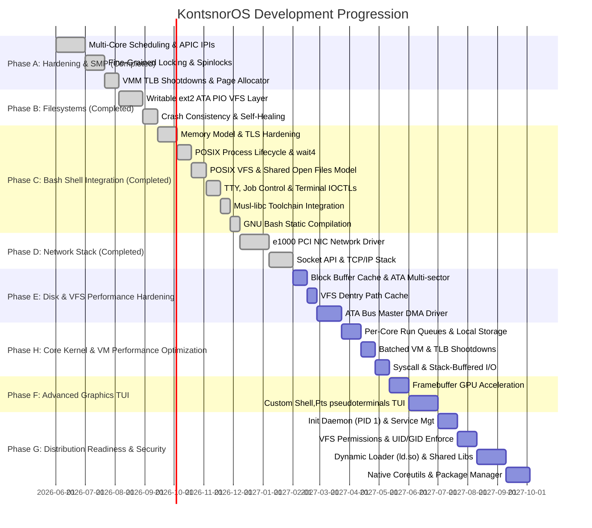

# KontsnorOS Development Roadmap & Architectural Backlog

This document outlines the strategic engineering roadmap and phase progression for **KontsnorOS** as it transitions from a hardened POSIX-compatible hybrid single-core kernel to a production-grade, highly secure, Symmetric Multiprocessing (SMP) operating system with a rich user-space ecosystem and high-performance device driver SDK.

---

## 🗺️ High-Level Phase Timeline

---

## 🛠️ Detailed Backlog Phases

### 🧱 Phase A: True Symmetric Multiprocessing (SMP) & Hardened Synchronization [Completed]
*Our SMP manager detects logical cores and schedules ready tasks concurrently across all logical cores under an interrupt-safe framework.*

#### Phase 28: Multi-Core Scheduling & Inter-Processor Interrupts (IPIs) [Completed]
- **Local APIC Timer per Core**: Configure individual LAPIC timers on each APIC core to fire independent scheduling preemptive ticks. [Completed]
- **Inter-Processor Interrupts (IPIs)**: Implement LAPIC-based interrupt broadcasting for cross-core signaling, thread preemption, and remote halts. [Completed]
- **SMP Scheduler Migration**: Upgrade the MLFQ scheduler to track per-core task states using Local APIC IDs, enabling concurrent thread execution. [Completed]

#### Phase 29: Fine-Grained Locking & Deadlock Detection [Completed]
- **Remove "Big Kernel Locks"**: Transition global locks to fine-grained mutexes or lock-free circular ring-buffers inside VFS, pipe buffers, and process tables. [Completed]
- **Ticket Spinlock Hardening**: Convert ticket spinlocks to automatically disable/restore local hardware interrupts on acquisition/release, preventing deadlocks. [Completed]
- **Dynamic Lock Diagnostics**: Build APIC ID-based spinlock tracking to assert against lock-reentrancy or lock-order violations. [Completed]

#### Phase 30: Virtual Memory Coherency & TLB Shootdowns [Completed]
- **TLB Shootdowns**: When a page table entry is modified (e.g. `sys_munmap`), broadcast a TLB shootdown IPI (Vector 36) to remote cores to invalidate active TLB caches. [Completed]
- **Lock-Free Physical Page Allocator**: Scale physical memory with per-core page allocator caches (`CORE_CACHES`) to eliminate lock contention during bulk allocations. [Completed]

---

### 💾 Phase B: Writable Filesystems & Crash Consistency [Completed]
*Transition the OS from a read-only VFS layout to a fully persistent, self-healing block storage partition.*

#### Phase 31: Writable ext2 Filesystem Implementation [Completed]
- **VFS Write Support**: Implement full `write`, `create`, `mkdir`, and `truncate` methods inside the `ext2` filesystem driver. [Completed]
- **Dynamic Block Allocation**: Add block and inode allocator bitmaps, dynamically locating free blocks from the Group Descriptor blocks on the disk image. [Completed]
- **VFS File Sync (`fsync`)**: Wire standard POSIX file descriptor flushing to ensure cached filesystem blocks are written back to physical disk. [Completed]

#### Phase 32: Writable IDE/ATA PIO Hard Drive Driver [Completed]
- **IDE/ATA Block Driver**: Implement a high-performance, interrupt-safe block device driver (`AtaDrive`) for standard Primary Slave IDE hard disks using LBA28 Port PIO. [Completed]
- **Dynamic VFS Storage Persistence**: Route file writes directly to physical disk media and automatically format blank drives with live ext2 structures on first boot. [Completed]

#### Phase 33: Crash Consistency & Simple Journaling [Completed]
- **Topological Write-Ordering Rules**: Enforce metadata write-ordering so that child blocks and raw inodes are committed before parent directory entries reference them. [Completed]
- **Self-Healing Consistency Check (FSCK)**: Implement a mount-time FSCK scan in `Ext2FileSystem::mount` that traces allocated inodes and blocks, detects bitmap discrepancies, and self-heals corrupted block/inode bitmaps on disk dynamically. [Completed]

---

### 🐚 Phase C: Bash Shell Integration [Completed]
*Establish the necessary system call interfaces, virtual memory invariants, and toolchain libraries to compile and execute a cross-compiled GNU Bash binary natively under Ring 3.*

#### Phase 34: Memory Model & TLS Hardening [Completed]
- **MSR FS_BASE Context Switching**: Swap the CPU's `FS_BASE` model-specific register (`0xC0000100`) on scheduler context switches to support thread-local storage (TLS) loading. [Completed]
- **FS_BASE Child Inheritance**: Inherit parent's `fs_base` register values inside `sys_fork` and `sys_clone` context creation pathways to preserve TLS states for child threads. [Completed]
- **Deep Page Table Cloning**: Ensure page directory cloning fully duplicates user address ranges up to PML4 boundary space, supporting nested address space copies. [Completed]
- **True Copy-on-Write (CoW)**: Implement reference-counted page frames and copy-on-write page fault handlers during `sys_fork` page table cloning to eliminate expensive user memory duplications. [Completed]

#### Phase 35: POSIX Process Lifecycle & Signal Completeness [Completed]
- **Non-Polling Wait Queues**: Upgrade the `sys_wait4` block mechanism to sleep parent processes on the child's wait-queue instead of polling, avoiding CPU cycles degradation. [Completed]
- **SIGCHLD Automatic Delivery**: Implement automatic asynchronous `SIGCHLD` (signal 17) raising and delivery to the parent task upon child exit or state transition. [Completed]
- **sys_clone Implementation**: Add standard Linux `clone` (syscall 56) with support for stack overrides, thread creation flags, and TLS pointer setups. [Completed]
- **sys_exit_group Implementation**: Support thread group exits via `exit_group` (syscall 231) to cleanly shut down user subshells and commands. [Completed]

#### Phase 36: POSIX VFS & Descriptor Alignment [Completed]
- **Shared Open File Description Model**: Share active file descriptors' offset and state indicators across duplicate operations (`dup`/`dup2`) and process forks (`sys_fork`), ensuring full POSIX descriptor synchronization. [Completed]
- **mprotect & File-Backed mmap**: Implement virtual memory protection modification (`sys_mprotect`) and file-backed memory maps (`sys_mmap` on active file descriptors) to support standard dynamic object allocation. [Completed]

#### Phase 37: TTY, Job Control & Terminal IOCTLs [Completed]
- **Job Control Support**: Support foreground/background session groups tracking in shell processes, mapping active `pgid` to tasks. [Completed]
- **Terminal IOCTLs**: Add `TIOCGWINSZ` (get window size), `TIOCSPGRP` (set process group), and `TIOCGPGRP` (get process group) in `/dev/tty` and character devices. Redefined the `Termios` structure layout to 36 bytes (`NCCS = 19`) to align with standard Linux x86_64 ABI and prevent stack corruption. [Completed]

#### Phase 38: Musl-libc Target & Toolchain Integration [Completed]
- **Stubs & Toolchain Building**: Set up stub headers and compiled static libc targets enabling static linking of C binaries. [Completed]

#### Phase 39: GNU Bash Static Compilation & Deployment [Completed]
- **Bash Packaging & Compilation**: Port GNU Bash to target KontsnorOS system structures, statically compiling the bash binary. [Completed]
- **Shebang '#!' Execve Parser**: Upgrade the kernel's binary loader in `sys_execve` to parse the shebang line dynamically, resolving interpreter paths (e.g. `#!/bin/bash` or `#!/bin/sh`) and executing them cleanly. [Completed]
- **QEMU Validation**: Boot KontsnorOS natively into an interactive GNU Bash shell in QEMU, verifying pipelines, scripts, and environmental variables. [Completed]

---

### 🌐 Phase D: Network Stack & Socket API [Completed]
*This phase connects KontsnorOS to the outside world, implementing standard socket APIs and networking hardware drivers.*

#### Phase 40: PCI Network Interface Card (NIC) Driver [Completed]
- **Intel e1000 Gigabit Ethernet Driver**: Write a DMA-based network driver for the standard `82540EM` PCI Ethernet controller simulated in QEMU. [Completed]
- **DMA Ring-Buffers**: Set up Tx (transmit) and Rx (receive) descriptor ring-buffers mapped directly to physical memory. [Completed]
- **Initialization Order**: Wire the network stack initialization (`net::init`) prior to the driver framework setup (`drivers::init`) inside `kernel_main`. [Completed]

#### Phase 41: Core IP Stack & Packet Processing [Completed]
- **Packet Dispatching**: Build a fast packet parsing engine for Ethernet frames. [Completed]
- **ARP, IP, UDP & ICMP Layers**: Implement address resolution (ARP), internet routing (IPv4), ICMP echo responses (ping), and user datagram processing (UDP). [Completed]
- **Loopback Interface (lo)**: Wire a high-speed internal loopback stack for local IPC socket communication. [Completed]

#### Phase 42: Socket System Calls & TCP Stack [Completed]
- **BSD Socket APIs**: Wire system calls 41-45 (`socket`, `connect`, `accept`, `sendto`, `recvfrom`) and 49-50 (`bind`, `listen`) to the core BSD socket manager layer. [Completed]
- **POSIX Errno Integration**: Map network error states to standard POSIX error numbers: `ENOTSOCK` (-88), `EDESTADDRREQ` (-89), `ENETUNREACH` (-101), `EISCONN` (-106), `ENOTCONN` (-107), `ECONNREFUSED` (-111). [Completed]
- **Lightweight TCP Stack**: Implement a stateful TCP flow machine with windowed packet acknowledgment and sliding congestion control. [Completed]
- **Freestanding Network Test**: Spawn and verify the user-space network test ELF (`net_test`) during the Ring 3 startup sequence in `kernel_main`. [Completed]

---

### 💾 Phase E: Disk & VFS Performance Hardening
*Address user-space performance bottlenecks by implementing standard caching layers and optimizing disk command paths.*

#### Phase 43: Block Buffer Cache & ATA Multi-Sector Support
- **LRU Block Buffer Cache**: Implement a global Least Recently Used (LRU) block buffer cache layer inside the kernel heap. Keep recently used 4096-byte blocks mapped to memory to avoid redundant disk block lookups.
- **ATA Multi-Sector Command Transfers**: Refactor the ATA driver to support commands for reading/writing multiple sectors in a single IO request rather than polling/looping sector-by-sector.
- **Yielding wait_ready**: Replace busy-wait spin loops in ATA status polling with cooperative scheduler yields when waiting on long-duration disk ready states.

#### Phase 44: Directory Entry (Dentry) Cache
- **Path Resolution Cache**: Cache resolved directory path nodes to avoid walking the VFS directory hierarchy (and performing disk lookup requests) repeatedly for identical paths.

#### Phase 45: ATA Bus Master DMA Driver
- **PCI Bus Master DMA**: Transition the ATA controller driver from Programmed I/O (PIO) to Bus Master DMA using Physical Region Descriptor Tables (PRDT) to transfer disk data directly to/from page frames without CPU busy polling.

---

### ⚡ Phase H: Core Kernel & VM Performance Optimization
*Minimize context switch latencies, lock contention, VM overhead, and memory allocation bottlenecks in the kernel hot paths.*

#### Phase 46: Low-Contention Scheduler & CPU-Local Storage
- **Per-Core Run Queues & Work-Stealing**: Partition scheduler priority queues per logical core, protecting each with a local lock. Implement cooperative work-stealing for load balancing across cores.
- **Lock-Free current_pid Resolution**: Store active task pointers/PIDs in per-core scratch spaces (`CpuScratch` or local segment offsets) to resolve the active thread PID lock-free via the `GS` register, avoiding global scheduler lock acquisition.
- **Per-Core GDT & TSS Layouts**: Allocate GDT/TSS structures per-core, ensuring TSS updates (e.g. TSS privilege stack RSP0 modifications on context switches) do not cause cross-core lock serialization.
- **Decoupled Task Table**: Refactor the master tasks collection (`tasks`) using read-mostly or fine-grained task locks to prevent task state queries from locking the execution queue scheduler.

#### Phase 47: Batched VM Operations & TLB Shootdowns
- **TLB Shootdown Batching**: Modify range-based virtual memory system calls (`mmap`, `munmap`, `mprotect`, `brk`) to execute page table updates sequentially without triggering immediate flushes, performing a single batched TLB shootdown (IPI broadcast) at the syscall boundary.
- **Lazy TLB Shootdowns**: Research deferred invalidation strategies for process teardown and context switches to minimize synchronous APIC ICR wait times.

#### Phase 48: High-Performance Syscall & I/O Pathways
- **Omission of Redundant MSR Accesses**: Avoid reading FS_BASE via `rdmsr` during context switches, relying on user-space base addresses already stored in the task context. Skip GS MSR changes during kernel-to-kernel context switches.
- **Zero-Allocation Stack-Buffered I/O**: Refactor the boundary hardening of `sys_read` and `sys_write` to copy data chunk-by-chunk using a stack-allocated buffer (e.g., 4 KiB) instead of making heap-allocated dynamic vector allocations (`alloc::vec!`) on the hot path.
- **Fast-Path Syscall Register Saving**: Avoid pushing/popping callee-saved registers (`rbx`, `rbp`, `r12`-`r15`) on standard fast-path syscalls that do not yield or context switch.

---

### 🖥️ Phase F: Advanced User-Space & GPU Graphics
*Transition the kernel output console into a modern graphical Terminal User Interface (TUI) and compile rich user applications.*

#### Phase 49: GPU Framebuffer Acceleration
- **BOCHS / VBE Graphics Driver**: Write a PCI display device driver supporting higher resolutions (e.g. 1920x1080) and 32-bit RGB double-buffering.
- **Hardware Cursor & Blitting**: Accelerate display rendering using DMA transfer windows to copy backbuffers without stressing the CPU.

#### Phase 50: Graphical Terminal & Console TUI
- **Terminal Emulator (Pts/PTY)**: Develop a hardware-accelerated user-space terminal emulator reading from TTY pseudoterminals (`/dev/pts/*`).
- **Font Rendering & Window Manager**: Map standard rasterized Unicode fonts and support basic window layout overlay blending.

---

### 📦 Phase G: Distribution Readiness & Multi-User Security
*Transform the current kernel-interactive setup into a self-contained, fully featured, multi-user Linux/Unix-like operating system distribution.*

#### Phase 51: Proper Init System (PID 1) & Re-parenting
- **Init Daemon (`/sbin/init`)**: Create a robust PID 1 process that mounts directories, runs initialization scripts, listens for system restarts/shutdowns, and spawns terminal getty terminals.
- **Orphan Re-parenting**: Ensure exiting tasks automatically re-parent their children to PID 1 to clean up zombie descriptors and prevent memory leaks.

#### Phase 52: VFS Permission Checks & Multi-User Model
- **Enforced File Permissions**: Update VFS lookup checks to validate read/write/execute flags against inode owner `uid`, group `gid`, and permission modes (`chmod` flags).
- **Process Credentials**: Fully implement `getuid`, `getgid`, `setuid`, and `setgid` system calls, enforcing privilege constraints (non-root cannot assume arbitrary IDs) and set-UID executable logic on `execve`.

#### Phase 53: Dynamic Linker (`ld.so`) & Shared Libraries
- **Dynamic ELF Loader**: Implement dynamic ELF parsing in the kernel and a user-space dynamic linker (`/lib/ld-kontsnoros.so`) to load shared object (.so) libraries.
- **VMM Shared Mappings**: Extend `sys_mmap` to support shared write memory mappings (`MAP_SHARED`), allowing clean IPC memory mapping and shared libraries sharing.

#### Phase 54: Package Manager & Native Toolchain [Partially Completed]
- **Native Ports/Compiler**: Bootstrap `gcc` or `clang` and `make` on KontsnorOS to allow compiling software natively inside the running OS.
- **Package Manager (`pkg`)**: Write a simple package manager to download, unpack, and install software packages from remote repositories via HTTP.
- **Standard Core Utilities (Coreutils) via BusyBox**: Cross-compile BusyBox statically using the musl-libc toolchain, integrate it into the ext2 filesystem, stub necessary syscalls (e.g., `symlink`, `symlinkat`, `readlink`), and expose standard Unix applets (`ls`, `cat`, `grep`, `ps`, `wc`, `uname`, etc.) via symlinks. [Completed]

---

## 🛡️ Strategic Principles & Quality Gates

On each phase of execution, the development workflow must rigidly adhere to these three core guidelines:

1. **Security-First Boundary Architecture**:
   - Every system call pointer argument MUST be validated for user-space range limit boundaries and translation mapping tables before dereferencing.
   - Any privilege transition must strictly secure context register configurations (such as zeroing unneeded registers to avoid leaks and stripping `IOPL`/`rflags` modification attempts).

2. **100% Compiler Warning-Free & Clippy Clean**:
   - The Rust kernel must compile in both `debug` and `release` configurations without generating a single compiler warning.
   - No micro-allocations or dangerous unsafe pointer mutations should be implemented without documented isolation rationale.

3. **Continuous QEMU Validation**:
   - Every architectural transition must be manually verified using the `./tools/run-qemu.sh` validation suite to ensure user-space applications (shells, pipelines, redirections) execute seamlessly without regressions.
