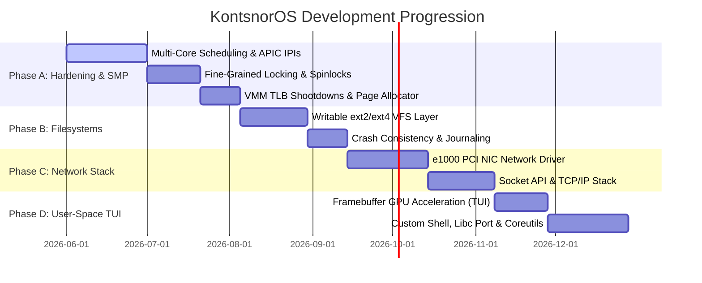

# KontsnorOS Development Roadmap & Architectural Backlog

This document outlines the strategic engineering roadmap and phase progression for **KontsnorOS** as it transitions from a hardenedPOSIX-compatible hybrid single-core kernel to a production-grade, highly secure, Symmetric Multiprocessing (SMP) operating system with a rich user-space ecosystem and high-performance device driver SDK.

---

## 🗺️ High-Level Phase Timeline

---

## 🛠️ Detailed Backlog Phases

### 🧱 Phase A: True Symmetric Multiprocessing (SMP) & Hardened Synchronization
*Our SMP manager currently detects logical cores but schedules on the Bootstrap Processor (BSP) only. This phase establishes a true parallel execution fabric.*

#### Phase 28: Multi-Core Scheduling & Inter-Processor Interrupts (IPIs)
- **Local APIC Timer per Core**: Configure individual LAPIC timers on each APIC core to fire independent scheduling preemptive ticks.
- **Inter-Processor Interrupts (IPIs)**: Implement LAPIC-based interrupt broadcasting for cross-core signaling, thread preemption, and remote halts.
- **SMP Scheduler Migration**: Upgrade the MLFQ scheduler to be global or per-core with dynamic work-stealing/load-balancing policies to run ready tasks concurrently across all logical cores.

#### Phase 29: Fine-Grained Locking & Deadlock Detection
- **Remove "Big Kernel Locks"**: Systematically audit VFS, pipe buffers, and process tables. Transition global locks into fine-grained mutexes or lock-free ring-buffers.
- **Lock-Order Analysis**: Document strict locking hierarchies to prevent deadlock conditions under parallel execution.
- **Dynamic Lock Diagnostics**: Build diagnostic checks (e.g., compile-time spinlock tracking) to detect or assert against lock-reentrancy or lock-order violations.

#### Phase 30: Virtual Memory Coherency & TLB Shootdowns
- **TLB Shootdowns**: When a page table entry is modified on one core (e.g., `sys_munmap` or `sys_mprotect`), broadcast a TLB shootdown IPI to all other cores mapping that address space to invalidate active TLB caches.
- **Lock-Free Physical Frame Allocator**: Scale the physical memory manager to use lock-free buddy allocators or thread-local frame caches to prevent lock contention during bulk allocations.

---

### 💾 Phase B: Writable Filesystems & Crash Consistency
*We currently boot from a read-only ext2 RAM disk mount. This phase transitions the OS to support dynamic local storage and writable block devices.*

#### Phase 31: Writable ext2 Filesystem Implementation [Completed]
- **VFS Write Support**: Implement full `write`, `create`, `mkdir`, and `truncate` methods inside the `ext2` filesystem driver. [Completed]
- **Dynamic Block Allocation**: Add block and inode allocator bitmaps, dynamically locating free blocks from the Group Descriptor blocks on the disk image. [Completed]
- **VFS File Sync (`fsync`)**: Wire standard POSIX file descriptor flushing to ensure cached filesystem blocks are written back to physical disk. [Completed]

#### Phase 32: Writable IDE/ATA PIO Hard Drive Driver [Completed]
- **IDE/ATA Block Driver**: Implement a high-performance, interrupt-safe block device driver (`AtaDrive`) for standard Primary Slave IDE hard disks using LBA28/LBA48 Port PIO. [Completed]
- **VFS Storage Persistence**: Route file writes directly to physical disk media and automatically format blank drives with live ext2 system structures on first boot to guarantee native persistency across reboots. [Completed]

#### Phase 33: Crash Consistency & Simple Journaling
- **Directory Inode Consistency**: Implement write-ordering rules and soft updates (or a lightweight metadata journal) to ensure the filesystem remains mountable and free of corruption in the event of an abrupt system reset.

---

### 🌐 Phase C: Network Stack & Socket API
*This phase connects KontsnorOS to the outside world, implementing standard socket APIs and networking hardware drivers.*

#### Phase 34: PCI Network Interface Card (NIC) Driver
- **Intel e1000 Gigabit Ethernet Driver**: Write a high-performance DMA-based network driver for the standard `82540EM` PCI Ethernet controller simulated in QEMU.
- **DMA Ring-Buffers**: Set up separate Tx (transmit) and Rx (receive) descriptor ring-buffers mapped directly to physical memory.

#### Phase 35: Core IP Stack & Packet Processing
- **Packet Dispatching**: Build a fast packet parsing engine for Ethernet frames.
- **ARP, IP, UDP & ICMP Layers**: Implement address resolution (ARP), internet routing (IPv4), ICMP echo responses (ping), and user datagram processing (UDP).
- **Loopback Interface (lo)**: Wire a high-speed internal loopback stack for local IPC socket communication.

#### Phase 36: Socket System Calls & TCP Stack
- **BSD Socket APIs**: Map standard system calls: `socket`, `bind`, `connect`, `listen`, `accept`, `send`, `recv`.
- **Lightweight TCP Stack**: Implement a stable, stateful Transmission Control Protocol (TCP) flow machine with windowed packet acknowledgment and sliding congestion control.

---

### 🖥️ Phase D: Advanced User-Space & GPU Graphics
*Transition the kernel output console into a modern graphical Terminal User Interface (TUI) and compile rich user applications.*

#### Phase 37: GPU Framebuffer Acceleration
- **BOCHS / VBE Graphics Driver**: Write a PCI display device driver supporting higher resolutions (e.g. 1920x1080) and 32-bit RGB double-buffering.
- **Hardware Cursor & Blitting**: Accelerate display rendering using DMA transfer windows to copy backbuffers without stressing the CPU.

#### Phase 38: Graphical Terminal & Console TUI
- **Terminal Emulator (Ring 3)**: Develop a hardware-accelerated user-space terminal emulator reading from TTY pseudoterminals (`/dev/pts/*`).
- **Font Rendering & Window Manager**: Map standard rasterized Unicode fonts and support basic window layout overlay blending.

#### Phase 39: Custom POSIX C Library (Libc) & Coreutils
- **Kontsnor Libc**: Develop a lightweight, fully standard C library (dual-licensed MIT/Apache) to compile standard POSIX software directly against KontsnorOS system call vectors, phasing out static inline assembly hacks.
- **Kernel-Supported Coreutils**: Write native user-space utility tools (`cat`, `ls`, `grep`, `mkdir`, `cp`, `mv`, `rm`, `kill`, `ps`) utilizing optimized syscall paths.

#### Phase 40: Fully Featured Interactive User Shell
- **Shell Upgrade**: Upgrade the shell with:
  - Command History (persistent `/home/user/.sh_history`).
  - Auto-complete via Tab using VFS directory reads.
  - Shell scripting variables and loops (`for`, `while`, `if`).

---

## 🛡️ Strategic Principles & Quality Gates

On each phase of execution, the development workflow must rigidly adhere to these three core guidelines:

1. **Security-First Boundary Architecture**:
   - Every system call pointer argument MUST be validated for user-space range limit boundaries and translation mapping tables before dereferencing.
   - Any privilege transition must strictly secure context register configurations (such as zeroing unneeded registers to avoid leaks and stripping `IOPL`/`rflags` modification attempts).

2. **100% Compiler Warning-Free & Clippy Clean**:
   - The Rust kernel must compile in both `debug` and `release` configurations without generating a single compiler warning.
   - No micro-allocations or dangerous unsafe pointer mutations should be implemented without documented isolation rationale.

3. **Continuous QEMU Validation**:
   - Every architectural transition must be manually verified using the `./tools/run-qemu.sh` validation suite to ensure user-space applications (shells, pipelines, redirections) execute seamlessly without regressions.
