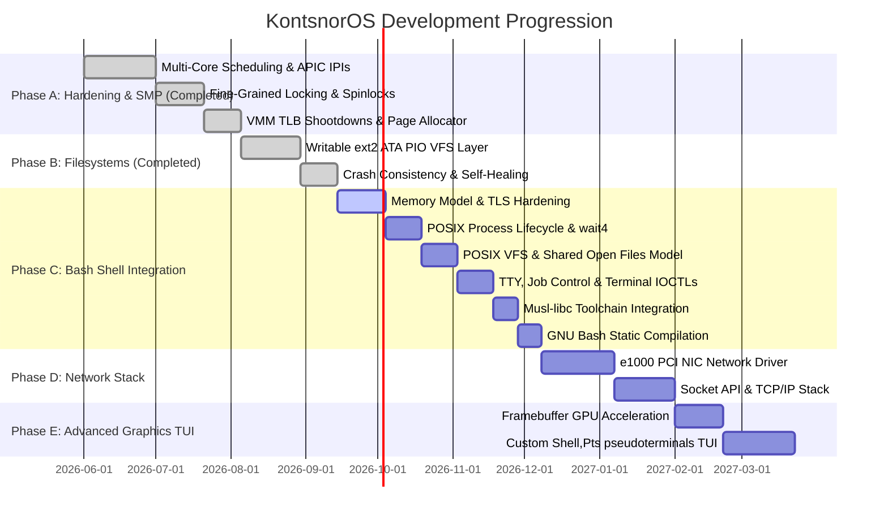

# KontsnorOS Development Roadmap & Architectural Backlog

This document outlines the strategic engineering roadmap and phase progression for **KontsnorOS** as it transitions from a hardened POSIX-compatible hybrid single-core kernel to a production-grade, highly secure, Symmetric Multiprocessing (SMP) operating system with a rich user-space ecosystem and high-performance device driver SDK.

---

## 🗺️ High-Level Phase Timeline

---

## 🛠️ Detailed Backlog Phases

### 🧱 Phase A: True Symmetric Multiprocessing (SMP) & Hardened Synchronization [Completed]
*Our SMP manager detects logical cores and schedules ready tasks concurrently across all logical cores under an interrupt-safe framework.*

#### Phase 28: Multi-Core Scheduling & Inter-Processor Interrupts (IPIs) [Completed]
- **Local APIC Timer per Core**: Configure individual LAPIC timers on each APIC core to fire independent scheduling preemptive ticks. [Completed]
- **Inter-Processor Interrupts (IPIs)**: Implement LAPIC-based interrupt broadcasting for cross-core signaling, thread preemption, and remote halts. [Completed]
- **SMP Scheduler Migration**: Upgrade the MLFQ scheduler to track per-core task states using Local APIC IDs, enabling concurrent thread execution. [Completed]

#### Phase 29: Fine-Grained Locking & Deadlock Detection [Completed]
- **Remove "Big Kernel Locks"**: Transition global locks to fine-grained mutexes or lock-free circular ring-buffers inside VFS, pipe buffers, and process tables. [Completed]
- **Ticket Spinlock Hardening**: Convert ticket spinlocks to automatically disable/restore local hardware interrupts on acquisition/release, preventing deadlocks. [Completed]
- **Dynamic Lock Diagnostics**: Build APIC ID-based spinlock tracking to assert against lock-reentrancy or lock-order violations. [Completed]

#### Phase 30: Virtual Memory Coherency & TLB Shootdowns [Completed]
- **TLB Shootdowns**: When a page table entry is modified (e.g. `sys_munmap`), broadcast a TLB shootdown IPI (Vector 36) to remote cores to invalidate active TLB caches. [Completed]
- **Lock-Free Physical Page Allocator**: Scale physical memory with per-core page allocator caches (`CORE_CACHES`) to eliminate lock contention during bulk allocations. [Completed]

---

### 💾 Phase B: Writable Filesystems & Crash Consistency [Completed]
*Transition the OS from a read-only VFS layout to a fully persistent, self-healing block storage partition.*

#### Phase 31: Writable ext2 Filesystem Implementation [Completed]
- **VFS Write Support**: Implement full `write`, `create`, `mkdir`, and `truncate` methods inside the `ext2` filesystem driver. [Completed]
- **Dynamic Block Allocation**: Add block and inode allocator bitmaps, dynamically locating free blocks from the Group Descriptor blocks on the disk image. [Completed]
- **VFS File Sync (`fsync`)**: Wire standard POSIX file descriptor flushing to ensure cached filesystem blocks are written back to physical disk. [Completed]

#### Phase 32: Writable IDE/ATA PIO Hard Drive Driver [Completed]
- **IDE/ATA Block Driver**: Implement a high-performance, interrupt-safe block device driver (`AtaDrive`) for standard Primary Slave IDE hard disks using LBA28 Port PIO. [Completed]
- **Dynamic VFS Storage Persistence**: Route file writes directly to physical disk media and automatically format blank drives with live ext2 structures on first boot. [Completed]

#### Phase 33: Crash Consistency & Simple Journaling [Completed]
- **Topological Write-Ordering Rules**: Enforce metadata write-ordering so that child blocks and raw inodes are committed before parent directory entries reference them. [Completed]
- **Self-Healing Consistency Check (FSCK)**: Implement a mount-time FSCK scan in `Ext2FileSystem::mount` that traces allocated inodes and blocks, detects bitmap discrepancies, and self-heals corrupted block/inode bitmaps on disk dynamically. [Completed]

---

### 🐚 Phase C: Bash Shell Integration
*Establish the necessary system call interfaces, virtual memory invariants, and toolchain libraries to compile and execute a cross-compiled GNU Bash binary natively under Ring 3.*

#### Phase 34: Memory Model & TLS Hardening
- **MSR FS_BASE Context Switching**: Swap the CPU's `FS_BASE` model-specific register (`0xC0000100`) on scheduler context switches to support thread-local storage (TLS) loading required by libc and GNU Bash.
- **Deep Page Table Cloning**: Ensure page directory cloning fully duplicates user address ranges up to PML4 boundary space, supporting nested address space copies.
- **True Copy-on-Write (CoW)**: Implement reference-counted page frames and copy-on-write page fault handlers during `sys_fork` page table cloning to eliminate expensive user memory duplications.

#### Phase 35: POSIX Process Lifecycle & Signal Completeness
- **Non-Polling Wait Queues**: Upgrade the `sys_wait4` block mechanism to sleep parent processes on the child's wait-queue instead of polling, avoiding CPU cycles degradation.
- **SIGCHLD Automatic Delivery**: Implement automatic asynchronous `SIGCHLD` signal raising and delivery to the parent task upon child exit or state transition.
- **Signal Masking Alignment**: Support standard POSIX signal sets masking, blocking, and nested signal handlers restoring in System V ABI frames.

#### Phase 36: POSIX VFS & Descriptor Alignment
- **Shared Open File Description Model**: Share active file descriptors' offset and state indicators across duplicate operations (`dup`/`dup2`) and process forks (`sys_fork`), ensuring full POSIX descriptor synchronization.
- **mprotect & File-Backed mmap**: Implement virtual memory protection modification (`sys_mprotect`) and file-backed memory maps (`sys_mmap` on active file descriptors) to support standard dynamic object allocation.

#### Phase 37: TTY, Job Control & Terminal IOCTLs
- **Job Control Support**: Support foreground/background session groups tracking in shell processes.
- **Terminal IOCTLs**: Add `TIOCGWINSZ` (get window size), `TIOCSPGRP` (set process group), and `TIOCGPGRP` (get process group) in `/dev/tty` and character devices.
- **Controlling Terminal Session Management**: Map controlling terminal sessions and raise `SIGHUP` and `SIGTSTP` appropriately to process groups.

#### Phase 38: Musl-libc Target & Toolchain Integration
- **Stubs & Toolchain Building**: Set up stub headers, compile stubs, and build a unified static `x86_64-kontsnoros-musl` target to compile freestanding C code and library stubs.

#### Phase 39: GNU Bash Static Compilation & Deployment
- **Bash Packaging & Compilation**: Port GNU Bash to target KontsnorOS system structures, statically compiling the bash binary.
- **Shebang '#!' Execve Parser**: Upgrade the kernel's binary loader in `sys_execve` to parse the shebang line dynamically, resolving interpreter paths (e.g. `#!/bin/bash` or `#!/bin/sh`) and executing them cleanly.
- **QEMU Validation**: Boot KontsnorOS natively into an interactive GNU Bash shell in QEMU, verifying pipelines, scripts, and environmental variables.

---

### 🌐 Phase D: Network Stack & Socket API
*This phase connects KontsnorOS to the outside world, implementing standard socket APIs and networking hardware drivers.*

#### Phase 40: PCI Network Interface Card (NIC) Driver
- **Intel e1000 Gigabit Ethernet Driver**: Write a high-performance DMA-based network driver for the standard `82540EM` PCI Ethernet controller simulated in QEMU.
- **DMA Ring-Buffers**: Set up separate Tx (transmit) and Rx (receive) descriptor ring-buffers mapped directly to physical memory.

#### Phase 41: Core IP Stack & Packet Processing
- **Packet Dispatching**: Build a fast packet parsing engine for Ethernet frames.
- **ARP, IP, UDP & ICMP Layers**: Implement address resolution (ARP), internet routing (IPv4), ICMP echo responses (ping), and user datagram processing (UDP).
- **Loopback Interface (lo)**: Wire a high-speed internal loopback stack for local IPC socket communication.

#### Phase 42: Socket System Calls & TCP Stack
- **BSD Socket APIs**: Map standard system calls: `socket`, `bind`, `connect`, `listen`, `accept`, `send`, `recv`.
- **Lightweight TCP Stack**: Implement a stable, stateful Transmission Control Protocol (TCP) flow machine with windowed packet acknowledgment and sliding congestion control.

---

### 🖥️ Phase E: Advanced User-Space & GPU Graphics
*Transition the kernel output console into a modern graphical Terminal User Interface (TUI) and compile rich user applications.*

#### Phase 43: GPU Framebuffer Acceleration
- **BOCHS / VBE Graphics Driver**: Write a PCI display device driver supporting higher resolutions (e.g. 1920x1080) and 32-bit RGB double-buffering.
- **Hardware Cursor & Blitting**: Accelerate display rendering using DMA transfer windows to copy backbuffers without stressing the CPU.

#### Phase 44: Graphical Terminal & Console TUI
- **Terminal Emulator (Pts/PTY)**: Develop a hardware-accelerated user-space terminal emulator reading from TTY pseudoterminals (`/dev/pts/*`).
- **Font Rendering & Window Manager**: Map standard rasterized Unicode fonts and support basic window layout overlay blending.

#### Phase 45: Custom POSIX C Library (Libc) & Coreutils
- **Kontsnor Libc**: Develop a lightweight, fully standard C library (dual-licensed MIT/Apache) to compile standard POSIX software directly against KontsnorOS system call vectors, phasing out static inline assembly hacks.
- **Kernel-Supported Coreutils**: Write native user-space utility tools (`cat`, `ls`, `grep`, `mkdir`, `cp`, `mv`, `rm`, `kill`, `ps`) utilizing optimized syscall paths.

#### Phase 46: Fully Featured Interactive User Shell
- **Shell Upgrade**: Upgrade the shell with:
  - Command History (persistent `/home/user/.sh_history`).
  - Auto-complete via Tab using VFS directory reads.
  - Shell scripting variables and loops (`for`, `while`, `if`).

---

## 🛡️ Strategic Principles & Quality Gates

On each phase of execution, the development workflow must rigidly adhere to these three core guidelines:

1. **Security-First Boundary Architecture**:
   - Every system call pointer argument MUST be validated for user-space range limit boundaries and translation mapping tables before dereferencing.
   - Any privilege transition must strictly secure context register configurations (such as zeroing unneeded registers to avoid leaks and stripping `IOPL`/`rflags` modification attempts).

2. **100% Compiler Warning-Free & Clippy Clean**:
   - The Rust kernel must compile in both `debug` and `release` configurations without generating a single compiler warning.
   - No micro-allocations or dangerous unsafe pointer mutations should be implemented without documented isolation rationale.

3. **Continuous QEMU Validation**:
   - Every architectural transition must be manually verified using the `./tools/run-qemu.sh` validation suite to ensure user-space applications (shells, pipelines, redirections) execute seamlessly without regressions.
