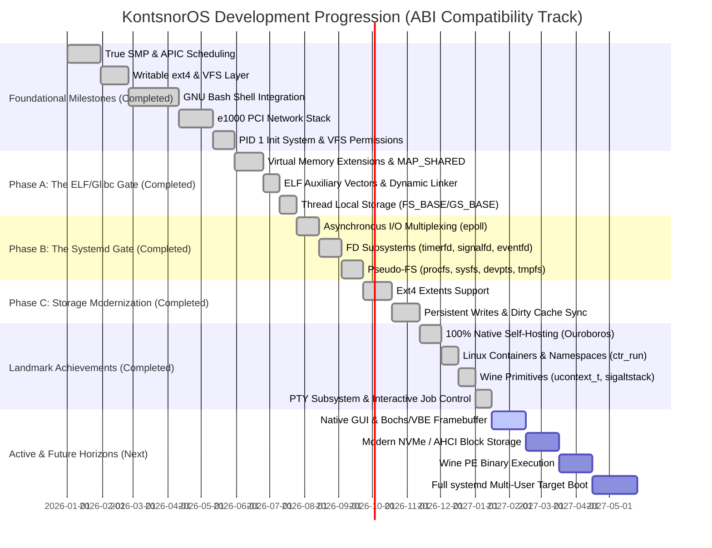
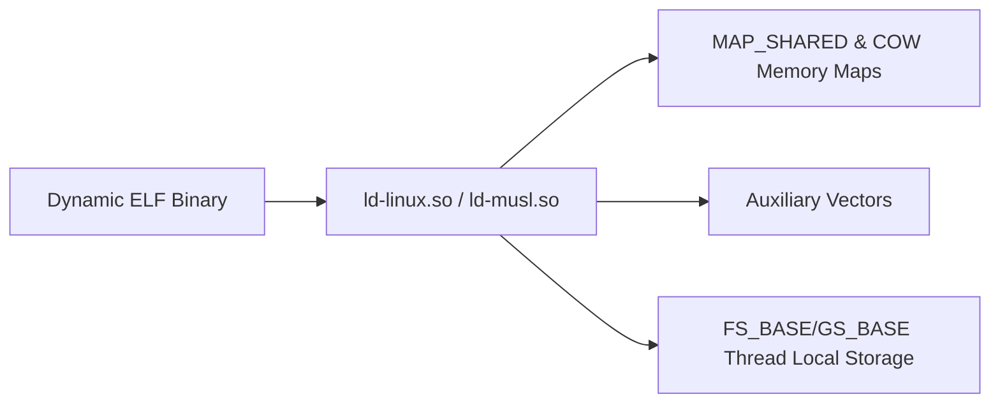
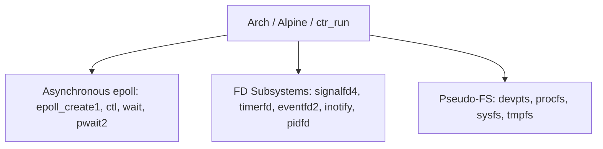
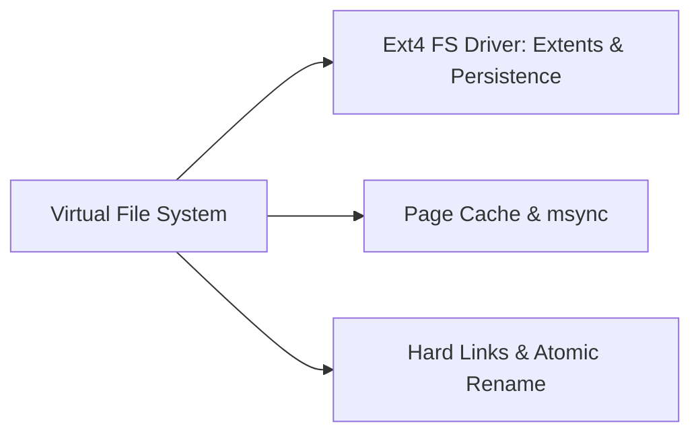
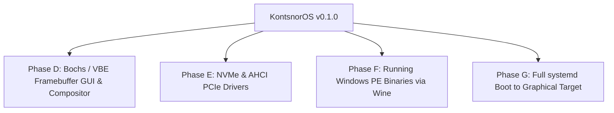

# KontsnorOS Strategic Roadmap: Linux ABI Compatibility Track

This document details the strategic engineering roadmap, architectural phases, and milestone progression for **KontsnorOS**. The project's ultimate, non-negotiable objective is to serve as an **uncompromising, drop-in replacement for the Linux Kernel (ABI-compatible)**, capable of booting unmodified, stock Linux distributions (both heavy `glibc`/`systemd` stacks like Arch/Ubuntu and lightweight `musl` stacks like Alpine) directly on our custom Rust-based hybrid architecture.

By prioritizing strict compliance with the Linux Application Binary Interface (ABI), we treat the entire Linux syscall and subsystem surface area as a bounded, Test-Driven Development (TDD) engineering problem optimized for high-velocity machine execution.

---

## 🗺️ Architectural Phase Timeline

---

## 🏛️ Foundational Milestones [Completed]

The initial foundations established the baseline stability of KontsnorOS:

1. **Symmetric Multiprocessing (SMP):** Dynamic detection of logical cores via ACPI, real-mode AP trampoline (`0x8000`), Local APIC periodic timers, Inter-Processor Interrupts (IPIs) for scheduler preemption, fine-grained ticket spinlocks, and TLB Shootdown (Vector 36).
2. **Writable Ext4 Filesystem:** Fully functional `write`, `create`, `mkdir`, and `truncate` operations in VFS, extent-tree traversal/allocation, LBA28 Port PIO IDE/ATA driver, and self-healing mount-time consistency check (FSCK) routines.
3. **Bash Shell Integration:** `FS_BASE` model-specific register context switching, COW page-fault allocations, `sys_clone` context creation, non-polling `wait4` queues, TTY/Job Control terminal IOCTLs, and statically compiled GNU Bash execution.
4. **Network Stack & Socket API:** Intel `82540EM` (e1000) Gigabit Ethernet PCI driver utilizing DMA ring-buffers, complete IP stack (ARP, IPv4, UDP, ICMP), loopback interface, and BSD-compliant socket syscalls (`socket`, `bind`, `connect`, `listen`, `accept`, `sendto`, `recvfrom`).
5. **Init System & Security Bounds:** User-space Init daemon (`/sbin/init`) running as PID 1 with zombie process reaping, re-parenting mechanics, Unix-like permission checks on VFS lookups, and process credentials (`uid`, `gid`, `euid`, `egid`).

---

## 🛠️ Linux ABI Compatibility Track

### Phase A: The Dynamic Runtime & Shared Library Engine (The ELF/Glibc Gate) [Completed]
*Objective: Implement the low-level primitives required for the kernel to load the dynamic linker (`ld.so`) and execute dynamically linked ELF binaries.*

1. **Virtual Memory Extensions & Shared Mappings:**
   * **`MAP_SHARED` Semantics:** Fully implemented `sys_mmap` flag `MAP_SHARED` allowing multiple processes to share identical physical page frames for IPC and memory-mapped files.
   * **Page Cache Backing:** Unified page cache layer caching disk sectors into memory pages, ensuring file-backed mappings operate synchronously with read/write syscalls.
   * **Copy-on-Write (COW):** Read-only sharing of dynamic library code segments across process boundaries, cloning physical frames only on write faults.
   * **Gap-Searching Allocator:** Low-overhead virtual address space allocation finding free memory regions for anonymous and file-backed mappings.
2. **ELF Auxiliary Vectors (`Elf64_auxv_t`):**
   * Pushes standard Linux auxiliary vectors onto the initial process stack during `sys_execve` (`AT_PAGESZ`, `AT_BASE`, `AT_ENTRY`, `AT_PHDR`, `AT_PHENT`, `AT_PHNUM`, `AT_RANDOM`, `AT_EXECFN`, `AT_SECURE`, `AT_UID`, `AT_EUID`, `AT_GID`, `AT_EGID`).
   * Clean control transfer to dynamic linkers (`ld-linux-x86-64.so.2` and `ld-musl-x86_64.so.1`).
3. **Thread Local Storage (TLS) & Architecture Primitives:**
   * `sys_clone` and `sys_clone3` with `CLONE_SETTLS`, `CLONE_PARENT_SETTID`, `CLONE_CHILD_SETTID`, and `CLONE_CHILD_CLEARTID`.
   * `sys_arch_prctl` supporting `ARCH_SET_FS`, `ARCH_GET_FS`, `ARCH_SET_GS`, and `ARCH_GET_GS`.
   * MSR preservation in context switching.

---

### Phase B: Asynchronous Events & Init Subsystems (The Systemd Gate) [Completed]
*Objective: Implement advanced POSIX/Linux extensions to satisfy modern service managers and runtime event loops.*

1. **Asynchronous I/O Multiplexing (`epoll`):**
   * Full implementation of `epoll_create`, `epoll_create1`, `epoll_ctl`, `epoll_wait`, `epoll_pwait`, and `epoll_pwait2`.
   * Integrated readiness wait-queues across pipes, sockets, character devices, timerfds, eventfds, and signalfds.
2. **File-Descriptor Subsystems:**
   * **`signalfd4`**: Allows signal consumption directly via file descriptor read loops.
   * **`timerfd`**: High-precision Local APIC backed timers exposed through file descriptors (`timerfd_create`, `timerfd_settime`, `timerfd_gettime`).
   * **`eventfd2`**: High-performance waitable counters for user-to-user and kernel-to-user notification.
   * **`inotify`**: Filesystem event notifications (`inotify_init1`, `inotify_add_watch`, `inotify_rm_watch`).
   * **`pidfd`**: Process descriptor handles (`pidfd_open`, `pidfd_send_signal`, `pidfd_getfd`).
3. **Pseudo-Filesystems:**
   * **`devpts`**: Virtual pseudo-terminal filesystem generating slave terminal nodes (`/dev/pts/N`) with grantpt/unlockpt IOCTLs.
   * **`procfs`**: Process state inspection nodes (`/proc/mounts`, `/proc/self`, `/proc/cpuinfo`, `/proc/meminfo`, `/proc/stat`).
   * **`sysfs`**: System hardware discovery nodes (`/sys/fs/cgroup`, `/sys/class/net`, `/sys/devices`).
   * **`tmpfs`**: High-speed memory-backed filesystem with directory hierarchies and fast unlink/rename.

---

### Phase C: Storage & Filesystem Modernization [Completed]
*Objective: Transition the storage interface to modern, fault-tolerant distribution defaults.*

1. **Ext4 File System Upgrade:**
   * **Ext4 Extents (`EXT4_FEATURE_INCOMPAT_EXTENTS`):** Full extents tree parsing and extent block index traversal, enabling contiguous block allocation and fast access for multi-gigabyte files.
   * **Persistent Block Writes:** Full physical sector allocation and metadata block updates committing dirty data blocks to storage.
   * **Timestamps:** Automatic update of `mtime` and `ctime` on file write operations.
   * **Hard Links & Symlinks:** Full hard link creation (`sys_link`, `sys_linkat`) and symbolic link resolution (`sys_symlink`, `sys_symlinkat`, `sys_readlink`, `sys_readlinkat`).
   * **Fast Atomic Rename:** Directory and file rename operations adhering to POSIX atomic guarantees (`sys_rename`, `sys_renameat`, `sys_renameat2`).
   * **Self-Healing FSCK:** Mount-time consistency validation checking and repairing bitmap and descriptor discrepancies.

---

## 🏆 Landmark Achievements [Completed]

### 1. 🚀 100% Native Self-Hosting (The Ouroboros Milestone)
Inside QEMU, on an SMP x86_64 machine running KontsnorOS:
- The native Rust toolchain (`cargo`, `rustc`, `rust-lld` targeting `x86_64-unknown-linux-musl`) successfully compiled all 18 dependency crates and linked `kontsnor-kernel` from scratch.
- Handled millions of system calls across 8 SMP cores (`mmap`, `futex`, `clone`, `rt_sigaction`, `epoll`, `read`, `write`).
- Resulted in a valid 3.2MB static-PIE ELF binary written directly to the Ext4 disk image.

### 2. 📦 Linux Container Runtime & Namespaces (`ctr_run`)
- Container runtime running inside KontsnorOS providing mount namespace isolation, PID virtualization, root filesystem switching via `pivot_root` / `chroot`, and resource configuration.
- Successfully runs full Arch Linux and Alpine Linux bootstrap distributions with dynamic linking, package managers, and interactive shells (`tools/run-arch-container.sh -i`).

### 3. 🍷 Kernel Primitives for Wine Support
- MSR switching for `ARCH_SET_GS` and `ARCH_GET_GS` in `sys_arch_prctl`.
- `MAP_FIXED_NOREPLACE` semantics in `sys_mmap` preventing accidental address space collisions.
- Full Linux x86_64 `ucontext_t` and `siginfo_t` stack frame construction on user stacks for signal delivery.
- Alternate signal stack management via `sys_sigaltstack`.

### 4. 🖥️ Interactive PTY & Terminal Job Control
- Full pseudo-terminal master/slave subsystem (`/dev/ptmx`, `/dev/pts/N`).
- Controlling terminal sessions (`setsid`, `TIOCSCTTY`, `TIOCSPGRP`, `TIOCGPGRP`).
- Process-group signal delivery deduplicated by thread group (`tgid`) to prevent sibling teardown races during Ctrl+C (`SIGINT`).

---

## 🔭 Active Horizons & Future Roadmap

### Phase D: Native GUI & Display Subsystem (Active)
* **Bochs / VBE PCI Graphics Driver**: Framebuffer initialization up to 1920x1080 resolution at 32 bpp.
* **Terminal Emulator & Rasterizer**: In-kernel or lightweight user-space terminal emulator with TrueType / rasterized Unicode font rendering.
* **Wayland / DirectFB Compositor**: Bring up a lightweight compositor running on top of our shared memory and event subsystems.

### Phase E: High-Speed PCIe Block Storage (NVMe / AHCI)
* **AHCI (SATA) Controller Driver**: Native Command Queuing (NCQ) for high-speed SATA block operations.
* **NVMe Storage Driver**: Submission and completion queue management mapped into physical memory via PCIe BARs.

### Phase F: Wine Binary Execution
* Validation of stock Wine binaries running on top of the Arch Linux container environment on KontsnorOS.
* Execution of unmodified Windows x86_64 PE applications and games.

### Phase G: Full systemd Boot to Multi-User Target
* Expand cgroup v2 controller hierarchies and udev hardware hotplug event generation to satisfy `systemd` default targets without fallback modes.

---

## 🔄 Automated TDD Feedback Loop (AI Collective Execution)

We leverage an automated Test-Driven Development (TDD) loop running inside our WSL2/QEMU integration pipeline:

### Technical Quality Gates

1. **Security-First Boundary Architecture**: All user pointer parameters are validated via `validate_user_ptr` / `validate_user_ptr_write`. Every `unsafe` block must be documented with a `// SAFETY:` clause.
2. **Zero Compiler Warnings & Clean Clippy**: The entire workspace must compile cleanly with `cargo clippy --workspace --all-targets -- -D warnings`.
3. **Continuous QEMU Validation**: Every commit must pass `./tools/run-tests.sh` before merging.
