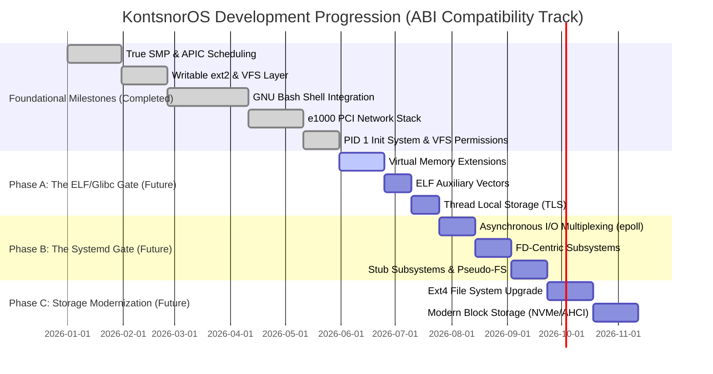
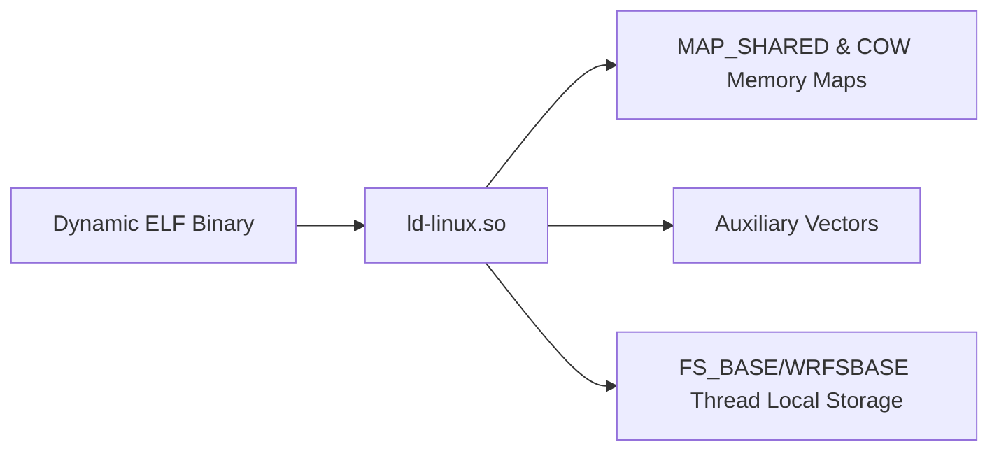
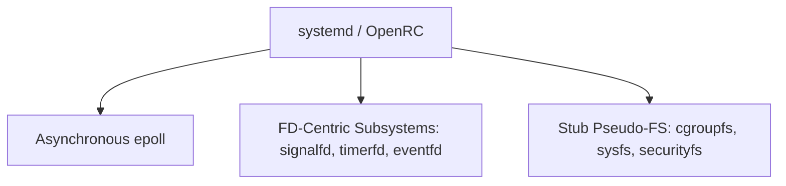
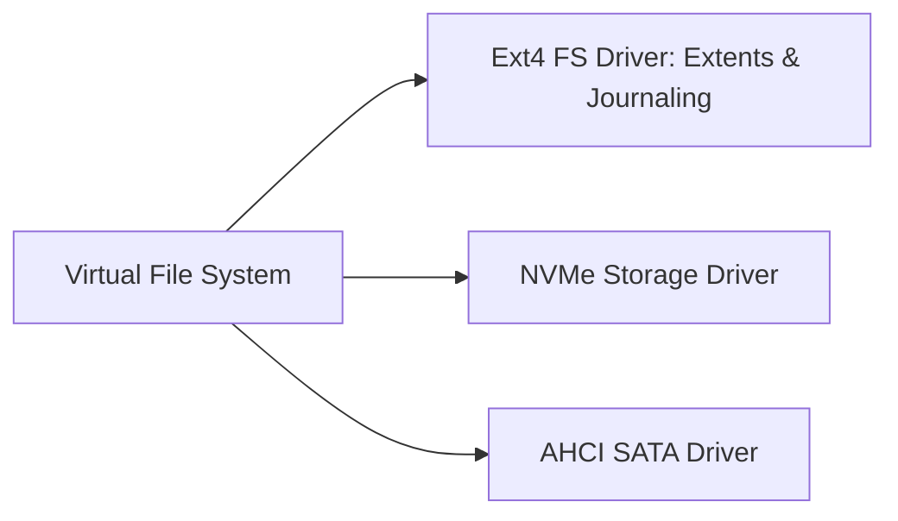
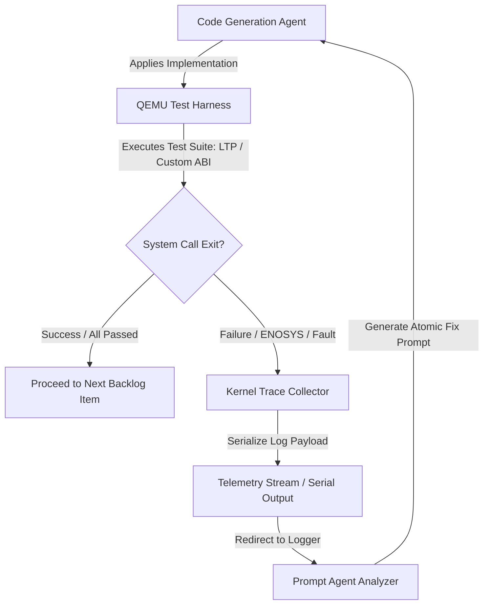

# KontsnorOS Strategic Roadmap: Linux ABI Compatibility Track

This document details the strategic engineering roadmap and phase progression for **KontsnorOS**. The project's ultimate, non-negotiable objective is to serve as an **uncompromising, drop-in replacement for the Linux Kernel (ABI-compatible)**, capable of booting unmodified, stock Linux distributions (both heavy glibc/systemd stacks like Ubuntu/Arch and lightweight musl stacks like Alpine) directly on our custom Rust-based hybrid architecture.

By prioritizing strict compliance with the Linux Application Binary Interface (ABI), we treat the entire Linux syscall and subsystem surface area as a bounded, Test-Driven Development (TDD) engineering problem optimized for high-velocity machine execution.

---

## 🗺️ Architectural Phase Timeline



---

## 🏛️ Foundational Milestones [Completed]

Before commencing the Linux ABI Compatibility Track, the core subsystems of KontsnorOS were established to verify general stability:

1. **Symmetric Multiprocessing (SMP):** Dynamic detection of logical cores, Local APIC periodic timers, Inter-Processor Interrupts (IPIs) for scheduler preemption, fine-grained ticket spinlocks, and TLB Shootdown (Vector 36) support.
2. **Writable ext2 Filesystem:** Fully functional `write`, `create`, `mkdir`, and `truncate` operations in VFS, LBA28 Port PIO IDE/ATA driver, and self-healing mount-time consistency check (FSCK) routines.
3. **Bash Shell Integration:** `FS_BASE` model-specific register context switching, COW page-fault allocations, `sys_clone` context creation, non-polling `wait4` queues, TTY/Job Control terminal IOCTLs, and statically compiled GNU Bash execution.
4. **Network Stack & Socket API:** Intel `82540EM` (e1000) Gigabit Ethernet PCI driver utilizing DMA ring-buffers, complete IP stack (ARP, IPv4, UDP, ICMP), loopback interface, and BSD-compliant socket syscalls (`socket`, `bind`, `connect`, `listen`, `accept`, `sendto`, `recvfrom`).
5. **Init System & Security Bounds:** User-space Init daemon (`/sbin/init`) running as PID 1 with zombie process reaping, re-parenting mechanics, Unix-like permission checks on VFS lookups, and process credentials (`uid`, `gid`, `euid`, `egid`).

---

## 🛠️ Linux ABI Compatibility Track

To boot unmodified, stock Linux distributions, the kernel must satisfy the runtime expectations of the dynamic linker (`ld.so`), library allocators (`glibc`), and service managers (`systemd`).

### Phase A: The Dynamic Runtime & Shared Library Engine (The ELF/Glibc Gate)
*Objective: Implement the low-level primitives required for the kernel to load the dynamic linker (`ld.so`) and execute dynamically linked ELF binaries.*



#### 1. Virtual Memory Extensions
* **MAP_SHARED Semantics:** Fully implement `sys_mmap` flag `MAP_SHARED` to permit processes to map the same physical page frames for inter-process communication and shared resources.
* **Page Cache Backing:** Build a unified Page Cache layer in the Virtual Memory Manager (VMM) to cache disk sectors into memory pages, ensuring file-backed mappings operate seamlessly with direct read/write paths.
* **Copy-on-Write (COW) Shared Libraries:** Optimize memory management to share page mappings of dynamic library code (e.g., `libc.so`) read-only across process boundaries, only copying pages to physical RAM upon write faults.

#### 2. ELF Auxiliary Vectors (`Elf64_auxv_t`)
* **Vector Parsing and Stack Injection:** During `sys_execve`, the kernel must parse and push standard Linux Auxiliary Vectors (`Elf64_auxv_t`) onto the initial process stack. These vectors provide critical system parameters to the dynamic loader, including page size, hardware capabilities, system call entry points, and path locations.
* **Dynamic Linker Handoff:** Ensure the auxiliary vector table correctly points to `/lib64/ld-linux-x86-64.so.2` (or the respective loader requested in the ELF binary's `.interp` section), cleanly transferring entry control flow to the dynamic linker.

#### 3. Thread Local Storage (TLS) & Context Refinements
* **sys_clone Thread Setup:** Refine `sys_clone` to accept the thread structure pointer from the caller and correctly store it in the architecture-specific registers.
* **WRFSBASE Instruction & MSR FS_BASE Control:** Enable the CPU hardware feature to allow user-space thread libraries (`glibc`, `musl`) to manipulate `FS_BASE` and `GS_BASE` via the `WRFSBASE`/`WRGSBASE` assembly instructions, avoiding the overhead of kernel-mode roundtrips during thread local storage lookups.

---

### Phase B: The Asynchronous Event & Init Gauntlet (The Systemd Gate)
*Objective: Implement advanced POSIX/Linux extensions to satisfy mainstream service managers (such as `systemd` or `OpenRC`) and prevent immediate kernel panics during early boot.*



#### 1. Asynchronous I/O Multiplexing (`epoll`)
* **epoll Ecosystem:** Implement `epoll_create1`, `epoll_ctl`, and `epoll_wait` system calls.
* **VFS Readiness Hooking:** Integrate epoll events into the VFS file descriptor architecture. Processes must register interest in read/write readiness on pipes, sockets, and character devices, waking up cooperatively on wait lists without polling.

#### 2. File-Descriptor Centric Subsystems
* **signalfd4:** Allow processes to accept POSIX signals via standard VFS file descriptors. This enables service managers to handle signals inside event loops (e.g., `epoll`) alongside socket traffic.
* **timerfd_create:** Expose high-precision kernel timers through file descriptors. This permits timer events to trigger events within the same multiplexed `epoll` infrastructure.
* **eventfd2:** Implement eventfd counters for lightweight userspace-to-userspace and kernel-to-userspace event notification.

#### 3. Stub Subsystems & Pseudo-Filesystems
* **cgroupfs v2:** Mount `/sys/fs/cgroup` and expose minimal stub control hierarchies. Provide simulated files that satisfy `systemd` status queries.
* **sysfs Configuration Nodes:** Mount `/sys` and construct key configuration nodes (e.g., CPU, block device, and module parameters) to allow standard utilities (`udevd`, `systemd`) to detect hardware configurations.
* **Security & Kernel Stubs:** Expose `/sys/kernel/security` and return clean `ENOSYS` drop-backs or default success codes for security frameworks (like AppArmor/SELinux checks) to bypass validation sweeps without forcing init failures.

---

### Phase C: Storage & Filesystem Modernization (The Ext4/NVMe Upgrade)
*Objective: Transition the storage interface from legacy emulated formats to modern distribution defaults for physical and virtual machines.*



#### 1. Ext4 File System Upgrade
* **Ext4 Extents Support:** Expand the writable `ext2` driver to support Ext4 Extents (`EXT4_FEATURE_INCOMPAT_EXTENTS`). This replaces the indirect block mapping table with contiguous physical sector structures, significantly improving performance for larger files.
* **Journaling Structure Parser:** Implement metadata parsing for the Ext4 journal log (`JBD2`). This allows the kernel to mount and read filesystems that possess journal active dirty bits, gracefully falling back to clean states when no recovery is needed.

#### 2. Modern Block Storage Drivers
* **AHCI (SATA) Controller Driver:** Utilize the PCI bus enumerator to initialize Advanced Host Controller Interface (AHCI) devices, organizing native command queues (NCQ) for high-speed SATA read/write requests.
* **NVMe Storage Controller Driver:** Write an NVMe driver utilizing PCIe registers, registering submission and completion queues directly in physical memory, and exposing partitions under the VFS `BlockDevice` trait.

---

## 🔄 Execution Strategy for Sub-Agents (The TDD Feedback Loop)

To scale the implementation of the ABI Compatibility Track, we use an automated Test-Driven Development (TDD) loop executing inside our WSL2/QEMU integration pipeline. The loop feeds back direct testing failures to the AI Agent collective:



### Technical Feedback Loop Specification

1. **LTP Test Execution:** During kernel test execution (triggered by `tools/run-tests.sh` or an integration hook), a suite of **Linux Test Project (LTP)** binaries or custom compiled syscall wrappers are run under Ring 3.
2. **ENOSYS & Fault Trapping:** When a binary executes a system call that is either unimplemented (`ENOSYS`) or violates expected Linux behaviour (e.g., incorrect register state returned, unexpected `errno`), the kernel's internal trace collector catches it.
3. **Telemetry Serialization:** The trace collector serializes the failure payload to the virtual serial port `/dev/ttyS0` in a structured JSON payload:
   ```json
   {
     "syscall_num": 291,
     "syscall_name": "epoll_create1",
     "executing_binary": "systemd",
     "registers": {
       "rax": "-38",
       "rdi": "524288"
     },
     "backtrace": [
       "0xffffffff801452aa",
       "0xffffffff80103de4"
     ],
     "expected_behavior": "Return new file descriptor instead of ENOSYS"
   }
   ```
4. **Agent Prompter Processing:** The QEMU wrapper redirects this output to the developer session. The Prompt Agent parses the failure context, cross-references it with POSIX/Linux specifications, and formulates the next atomic implementation prompt to build out the missing compatibility logic.

---

## 🛡️ Strategic Principles & Quality Gates

On every phase of execution, the agent workflow must rigidly adhere to these guidelines:

* **Security-First Boundary Architecture:**
  Every syscall pointer parameter must be strictly audited (`validate_user_ptr` and `validate_user_ptr_write`) on all syscall boundaries. Address spaces must be verified as mapped within the user space limits to prevent kernel memory disclosure or execution vector exploits. Every `unsafe` block must document a `// SAFETY:` clause.
* **100% Compiler Warning-Free & Clippy Clean:**
  The Rust kernel must compile in both `debug` and `release` configurations without generating a single compiler warning.
* **Continuous QEMU Validation:**
  Every commit must compile and pass the testing scripts (`./tools/run-tests.sh` and `cargo clippy --workspace --all-targets -- -D warnings`), ensuring there are no execution regressions.
